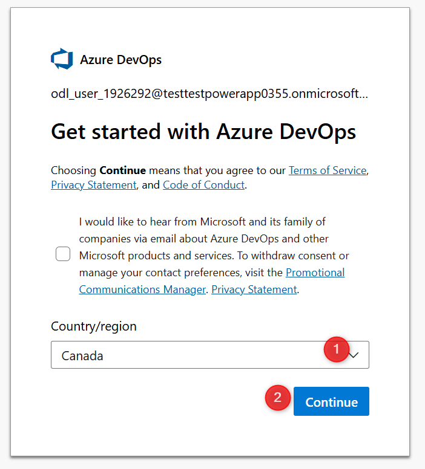

# 🚀 Lab 1: Setup and Configure

Welcome to PPCC25! In this first lab, you’ll setup the necessary prerequisites to complete subsequent labs. In the real world, your organization might have less sophisticated or more sophisticated DevOps requirements. This workshop covers the most adopted tools for enterprise scale DevOps with the least amount of effort and complexity. 

✅ Lab 1 tasks

In this lab, you will go through the following tasks:

1. Log on to your account
2. Rename your environments
3. Enable Copilot Studio 
4. Create an Azure DevOps project and repository

> Estimated time: 15-20 minutes

## Task 1: Log on to your account
> **Important:** 
> Your workshop tenant will be deleted within two days after the workshop.

1.	Open a new in-private window in Edge (or in Cognito if using Chrome).
2.	Use the credentials provided during the workshop. Save these in case you’re logged out.
3.	Go to the [Power Platform Admin Center](https://aka.ms/ppac)

## Task 2: Rename your environments
This step ensures your environments have meaningful names based on their intended use, which avoids confusion later. Rename the following environments.

| Original Environment Name | New Environment Name | Purpose |
|---|---|---|
| Power App User 1 | Dev | Development |
| Power App User 2 | Hotfix | Secondary environment for hotfix development and multi-environment testing |
| Power App User 3 | UAT | Testing your solution |
| Power App User 4 | Production | Where your solutions are shared with end users |

1.	Select **Manage** then **Environments**. You should see 10 Production environments and one Default environment.
2.	Rename the environments per the above table, select each environment, then click **Edit** in the **Details** section.
3.	Enter a new **Name** and **Save**. After saving, you don’t need to wait for it to finish processing. 

## Task 3: Enable Copilot Studio authors
1.	Go to the [Power Platform Admin Center](https://aka.ms/ppac)
2.	On the left menu, select, **Manage**, then **Tenant Settings**
3.	Select **Copilot Studio authors**
4.	**Edit** the **Security group**, select **All Company**, then **Done**.

In the real world, you might allow a smaller group of individuals to create agents depending on your organizational policies. 

## Task 4: Create an Azure DevOps project and repository
1.	Open a new tab within the same browser
2.	Go to [Azure DevOps](https://azure.microsoft.com/en-us/pricing/details/devops/azure-devops-services/)
3.	Under **Basic plan** select **Start free**

4.	On the next screen, select **Canada**, then **Continue**

5.	On the next screen, select **Canada**, solve the puzzle, and **Continue**
6.	You will be redirected to your Azure DevOps organization in a moment.

7.	Enter **Power Platform** for the **Project name** of your choice. For example, PPCC25DevOps

8.	Select **Repos** in the left menu, then **Initialize**

Now you have a source code repository! If you’re not familiar with source code, don’t worry. In Lab 2 you’ll learn how to use source control within the comfort of your Power Platform environment. 
While this lab only requires one user, in the real world you’ll need to add other collaborators to the Azure DevOps organization and project with Basic access. 

