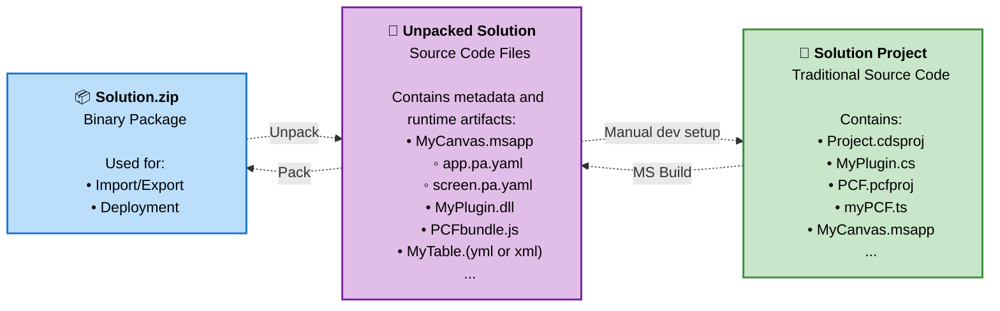

# 🧪 Lab 2: Building Power Platform Solutions

Replace this paragraph with a short description of the lab: goals, expected outcomes, and any high-level notes.

✅ Lab tasks

In this lab, you will go through the following tasks:

1. [Import and commit a solution in your dev environment](#-task-1-import-and-commit-a-solution-in-your-dev-environment)
1. [Edit your solution](#-task-2-edit-your-solution)
1. Work as a team in multiple environments.
1. Create a new agent.

## 💻 Solution is your Source Code

For low-code makers, your **Power Platform Solution** is your source code - it's the complete description of what you're building that you can open and edit in the Solution Explorer within the maker portal.

## 📦 Understanding Solution Abstractions

The term "solution" can be confusing because it represents different levels of abstraction depending on the context:

### Three Levels of Solution Abstraction

1. **Solution Project (.cdsproj)** - Traditional Source Code
   - This is the traditional developer source code format
   - Contains project files, references, and build configurations
   - Used by professional developers with Visual Studio and MS Build

1. **Unpacked Solution** - Metadata and Runtime Artifacts
   - Collection of individual files: `.msapp`, `.xml`, `.js`, `.dll` files
   - Human-readable metadata that describes your Power Platform components
   - Can be version controlled and merged like traditional source code

1. **Solution Package (.zip)** - Binary Package
   - Compressed binary version of the metadata and runtime artifacts
   - Used for import/export operations between environments
   - What you see when you export a solution from the Power Platform admin center

**Key Insight:** All three formats represent the same logical solution, just at different levels of abstraction. The unpacked solution serves as the "source of truth" that can be packed into a .zip for deployment or built into a project for professional development workflows.

### Solution Abstraction Flow

> **Note:** It's not possible to generate traditional source code from runtime artifacts in a solution. Traditional source code must be maintained in a repository by the developer as part of their development workflow.

---

## 📥 Task 1: Import and commit a solution in your dev environment

In this task, we will work with the **Solution binary package** (.zip format) as defined earlier in our abstractions. This is the packaged format used for importing and exporting solutions between Power Platform environments.

### Step 1: Import the solution into Power Apps

1. **Navigate to the Power Apps maker portal**
   - Go to [make.powerapps.com](https://make.powerapps.com)
   - Select your development environment

2. **Access the solution import feature**
   - In the left navigation, click on **Solutions**
   - Click **Import solution** at the top of the page

3. **Upload the solution file**
   - Click **Choose File** or **Browse**
   - Navigate to the `assets` folder in this repository
   - Select the solution `.zip` file provided for this lab
   - Click **Next**

4. **Configure import settings**
   - Review the solution information
   - Choose import options as needed (typically keep defaults)
   - Click **Import**

5. **Wait for import completion**
   - Monitor the import progress
   - Verify the solution appears in your Solutions list

### Step 2: Commit the solution using Power Platform Git integration

1. **Enable Git integration** (if not already configured)
   - In the Solutions area, select your imported solution
   - Click **Settings** > **Git integration**
   - Connect to your repository and branch

2. **Commit the solution to source control**
   - Go to **Source control** tab in your solution
   - Add a commit message: "Initial import of [solution name]"
   - Click **Commit** to save the solution to your Git repository

3. **Verify the commit**
   - Check your Git repository to confirm the solution files were committed
   - Review the folder structure created by the Power Platform Git integration

> **Expected outcome:** Your solution is now imported into your development environment and committed to source control as an unpacked solution format.

---

## ✏️ Task 2: Edit your solution

In this task, we will work with the **Solution Explorer** in the Power Apps maker portal as our reference for source code. You'll learn how changes flow between the maker portal and your Git repository, including how to handle conflicts.

### Step 1: Edit the Canvas App with YAML code

1. **Open the solution in maker portal**
   - Navigate to your imported solution
   - Find and open the Canvas app component
   - Switch to **Tree view** in the app designer

2. **Import YAML code snippet**
   - In the app designer, select a screen or control
   - Use **Copy** and **Paste YAML** functionality
   - Paste the provided YAML snippet from the `assets` folder
   - Review the changes in the app designer

### Step 2: Save, publish and commit changes

1. **Save the app**
   - Click **Save** in the app designer
   - Add a meaningful save comment

2. **Publish the app**
   - Click **Publish** to make changes available
   - Confirm the publication

3. **Commit to repository**
   - Go to **Source control** tab in your solution
   - Add commit message: "Updated canvas app with new YAML snippet"
   - Click **Commit**

### Step 3: Make changes from the repository using vscode.dev

1. **Open repository in vscode.dev**
   - Navigate to your GitHub repository
   - Press `.` (period key) to open vscode.dev
   - Or change URL from `github.com` to `vscode.dev`

2. **Find and edit YAML files**
   - Navigate to your solution's unpacked files
   - Find the canvas app `.msapp` folder structure
   - Locate a YAML file (e.g., screen configuration)
   - Make a minor change (update a property value or text)

### Step 4: Commit changes using VS Code

1. **Stage and commit changes**
   - Use the Source Control panel in vscode.dev
   - Stage your changes
   - Add commit message: "Minor YAML update from repository"
   - Commit and push changes

### Step 5: Reverse sync - Get changes from repository

**Important concepts:**
- **Reverse Sync**: Getting code changes from the repository back into your maker portal environment
- **Source of Truth**: In conflict situations, you must decide whether the repository or maker portal version is correct
- **No merging**: Unlike traditional code, you don't merge Power Platform conflicts - you choose one source as authoritative

1. **Perform reverse sync in maker portal**
   - Return to your solution in Power Apps maker portal
   - Go to **Source control** tab
   - Click **Get changes** or **Sync** to pull repository changes
   - Review the incoming changes

2. **Verify changes applied**
   - Open the canvas app to confirm your repository changes are reflected
   - Check that the YAML modifications are visible

### Step 6: Create a conflict scenario

1. **Make simultaneous changes**
   - **In maker portal**: Edit the same canvas app element you modified in the repo
   - **In repository**: Using vscode.dev, make a different change to the same YAML property
   - Commit both changes

2. **Handle the conflict**
   - Attempt to sync in the maker portal
   - **Important**: You'll need to choose your source of truth
   - **Repository wins**: Accept repository version (recommended for team scenarios)
   - **Maker portal wins**: Keep maker portal version and commit over repository

3. **Resolution strategy**
   - Decide on your source of truth based on context
   - Communicate with team about the chosen resolution
   - Document the decision for future reference

> **Expected outcome:** You understand how to work with both maker portal and repository, handle reverse sync, and resolve conflicts by choosing a source of truth.

> **Key learning**: More complex merge scenarios and team collaboration patterns will be covered in the next lab. 

