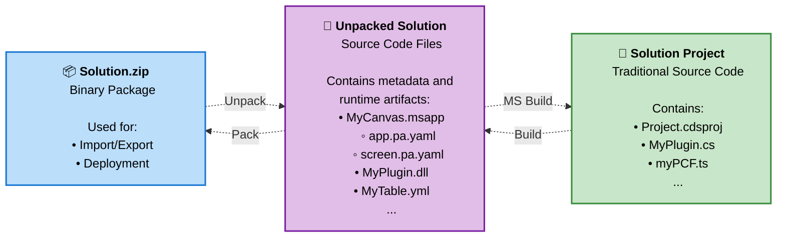

# 🧪 Lab 2: Building Power Platform Solutions

Replace this paragraph with a short description of the lab: goals, expected outcomes, and any high-level notes.

✅ Lab tasks

In this lab, you will go through the following tasks:

1. Import and commit a solution in your dev environment.
1. Edit you solution.
1. Work as a team in multiple environments.
1. Create a new agent.

## 💻 Solution is your Source Code

For low-code makers, your **Power Platform Solution** is your source code - it's the complete description of what you're building that you can open and edit in the Solution Explorer within the maker portal.

## Understanding Solution Abstractions

The term "solution" can be confusing because it represents different levels of abstraction depending on the context:

### 🔄 Three Levels of Solution Abstraction

1. **Solution Project (.cdsproj)** - Traditional Source Code
   - This is the traditional developer source code format
   - Contains project files, references, and build configurations
   - Used by professional developers with Visual Studio and MS Build

2. **Unpacked Solution** - Metadata and Runtime Artifacts
   - Collection of individual files: `.msapp`, `.xml`, `.js`, `.dll` files
   - Human-readable metadata that describes your Power Platform components
   - Can be version controlled and merged like traditional source code

3. **Solution Package (.zip)** - Binary Package
   - Compressed binary version of the metadata and runtime artifacts
   - Used for import/export operations between environments
   - What you see when you export a solution from the Power Platform admin center

**Key Insight:** All three formats represent the same logical solution, just at different levels of abstraction. The unpacked solution serves as the "source of truth" that can be packed into a .zip for deployment or built into a project for professional development workflows.

### Solution Abstraction Flow

> Estimated time: [xx minutes]
