# 🧪 Lab 2: Building Power Platform Solutions

The inner loop is where developers spend most of their time - writing code, testing changes, and iterating quickly. In Power Platform, your **solution is your source code**. This lab focuses on working in the inner loop with your Power Platform solution, exploring how solutions exist at different levels of abstraction (binary packages, unpacked metadata files, and traditional source code projects), and how Power Platform Git Integration enables version control collaboration. You'll learn how to handle conflicts when changes occur in multiple places, work across development environments, and integrate AI agents into your ALM workflow. This hands-on lab demonstrates the complete inner-loop lifecycle of managing Power Platform solutions.

✅ Lab tasks

In this lab, you will go through the following tasks:

1. [Import and commit a solution in your dev environment](#-task-1-import-and-commit-a-solution-in-your-dev-environment)
1. [Edit your solution](#️-task-2-edit-your-solution)
1. [Work as a team in multiple environments](#-task-3-work-as-a-team-in-multiple-environments)
1. [Create a new agent](#-task-4-create-a-new-agent)

## 💻 Solution is your Source Code

For low-code makers, your **Power Platform Solution** is your source code - it's the complete description of what you're building that you can open and edit in the Solution Explorer within the maker portal.

## 📦 Understanding Solution Abstractions

The term "solution" can be confusing because it represents different levels of abstraction depending on the context:

### Three Levels of Solution Abstraction

1. **Solution Package (.zip)** - Binary Package
   - Compressed binary version of the metadata and runtime artifacts
   - Used for import/export operations between environments
   - What you see when you export a solution from the Maker Portal.

1. **Unpacked Solution** - Metadata and Runtime Artifacts
   - Collection of individual files: `.msapp`, `.xml`, `.js`, `.dll` files
   - Human-readable metadata that describes your Power Platform components
   - Metadata can be version controlled and merged like traditional source code

1. **Solution Project (.cdsproj)** - Traditional Source Code
   - This is the traditional developer source code format
   - Contains project files, references, and build configurations
   - Used by professional developers with Visual Studio and MS Build

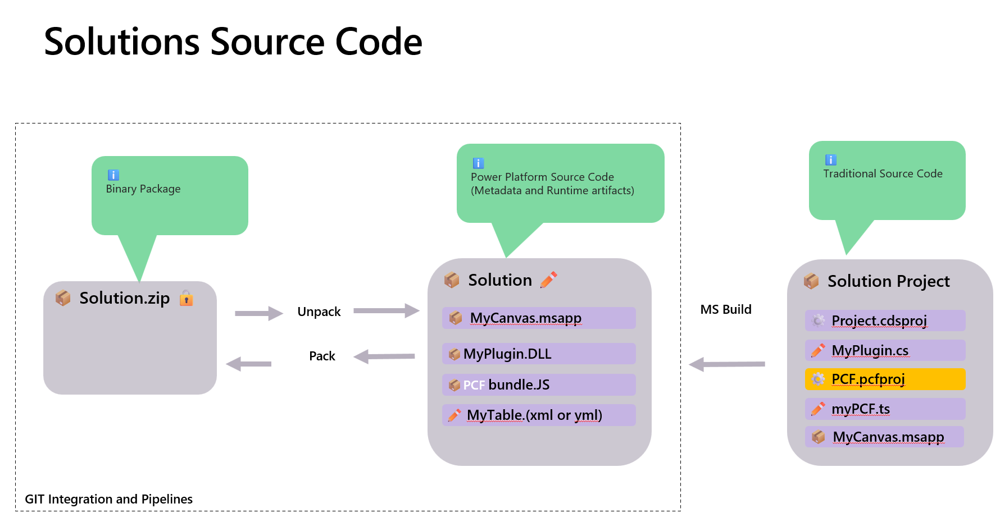

> **Note:** It's not possible to generate traditional source code from runtime artifacts in a solution. Traditional source code must be maintained in a repository by the developer as part of their development workflow.

**Key Insight:** All three formats represent the same logical solution, just at different levels of abstraction. **Power Platform Git Integration covers only the unpacked solution** - it enables version control, collaboration, and deployment of low-code components. **Traditional source code** (like C# plugins, TypeScript PCF components, and project files) should be managed by traditional source code tools and development workflows alongside Power Platform components in your repository.

---

## 📋 Prerequisites

To complete this lab, you need to have the following environments and resources configured:

### Environments

| Environment Name | Environment Type | Purpose |
|---|---|---|
| Dev | Development | Primary development environment for creating and testing solutions |
| HotFix | Development | Secondary environment for hotfix development and multi-environment testing |

### Repository

- **Azure DevOps Repository**: You need an Azure DevOps repository configured with Git integration enabled. This repository will store your solution's unpacked metadata files and enable version control collaboration.

---

## 📥 Task 1: Import and commit a solution in your dev environment

In this task, we will work with the **Solution binary package** (.zip format) as defined earlier in our abstractions. This is the packaged format used for importing and exporting solutions between Power Platform environments.

### Step 1: Import the solution into Power Apps

1. **Navigate to the Power Apps maker portal**
   - Go to [make.powerapps.com](https://make.powerapps.com)
   - Select the environment "Dev"

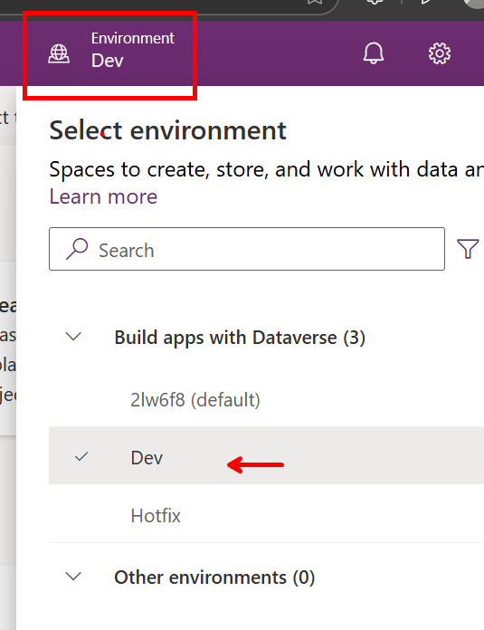

1. **Access the solution import feature**
   - In the left navigation, click on **Solutions**

   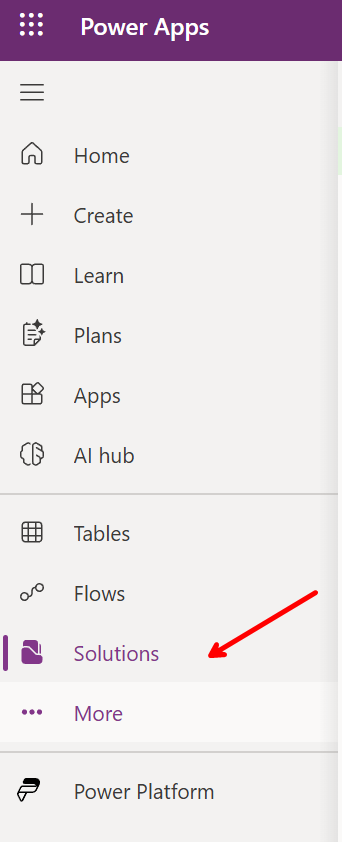

   - Click **Import solution** at the top of the page

1. **Upload the solution file**
   - Download the solution [ContosoRealEstate](assets/ContosoRealEstate_1_0_0_2.zip) available in the assets folder of this repo.
   - Click **Choose File** or **Browse**
   - Navigate to the `assets` folder in this repository
   - Select the solution `.zip` file provided for this lab
   - Click **Next**

1. **Configure import settings**
   - Review the solution information
   - Click **Import**

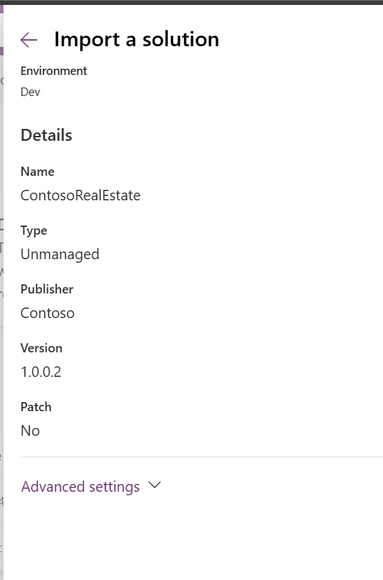

1. **Wait for import completion**
   - Monitor the import progress

   

   - Verify the solution appears in your Solutions list

   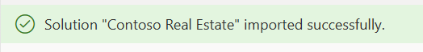

1. **Publish all customizations**
   - After the solution import completes, open the Solution **Contoso Real Estate**
   - Select **Publish all customizations**
   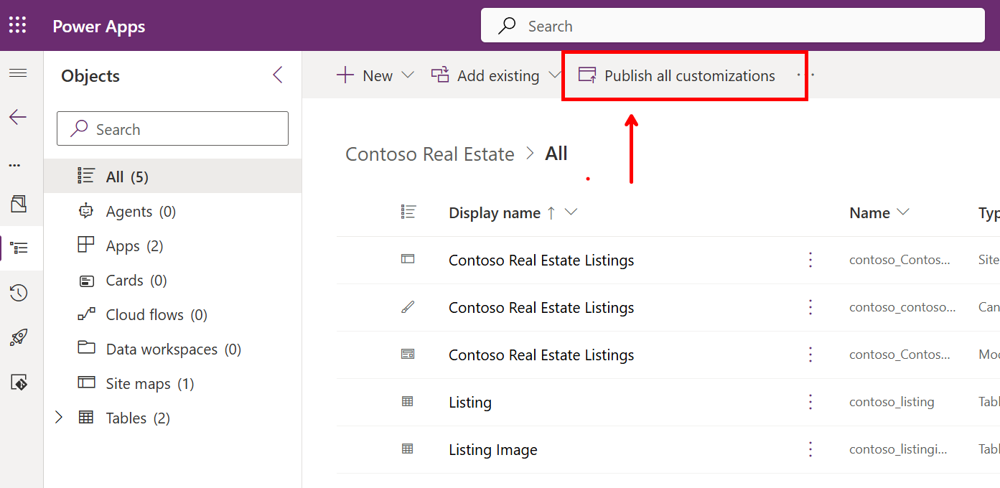
   - Wait for the publish process to complete
   - This ensures all components in the solution are published and ready to use

1. **Import configuration data (optional)**
   > note: This step requires [Power Platform CLI](https://learn.microsoft.com/power-platform/developer/cli/reference/data) installed in a windows machine.

The Contoso Real Estate solution contains the schema and components (tables, apps, flows) but does not include sample data. If you would like to populate your environment with configuration data for testing purposes, you can import the data using PAC CLI.

To import the [data](assets/ContosoRealEstateData.zip), you can use either:

```powershell
pac data import -d [file]
```

or use the Configuration Migration Tool:

```powershell
pac tool CMT
```

### Step 2: Commit the solution using Power Platform Git integration

1. **Enable Git integration** (if not already configured)
   - In the Solutions area, click Connect to Git

   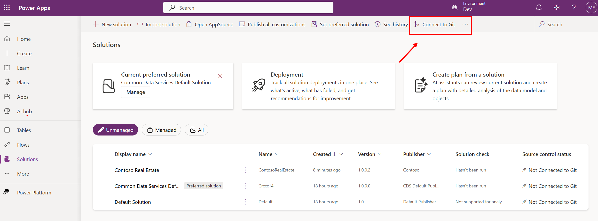

   - Connect to your Azure DevOps Organization. In the dialog, select:
     - Connection type: *Solution*
     - Organization: Select the available
     - Project: Select an available project
     - Repository: select an available Repository
     - Root Git folder: PP

     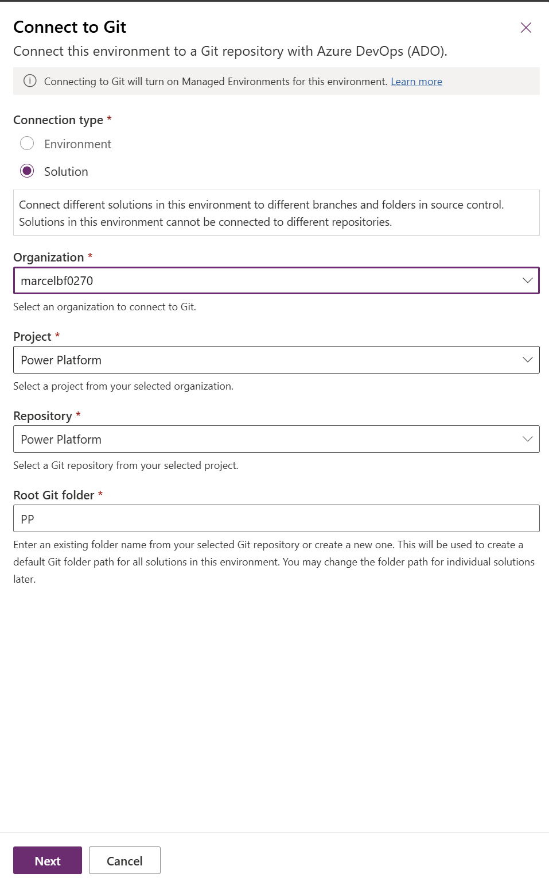

     Note: if you don't have an organization to select you must create an Azure DevOps Organization.

   - Connect to your repository and branch. In the dialog, select:
     - Solution: ContosoRealEstate
     - Branch: Main
     - Git folder: PP/ContosoRealEstate
     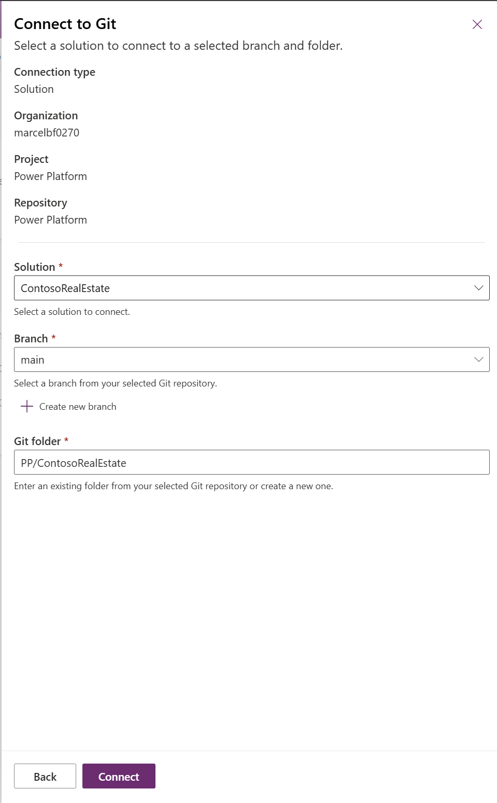
   - Click Connect

You are now connect to your GIT repository!

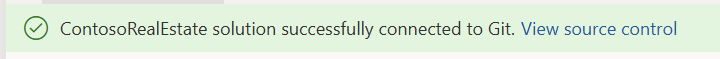

1. **Commit the solution to source control**
   - In **Solution explorer**, open the solution **Contoso Real Estate**
   - Go to **Source control** tab in your solution
   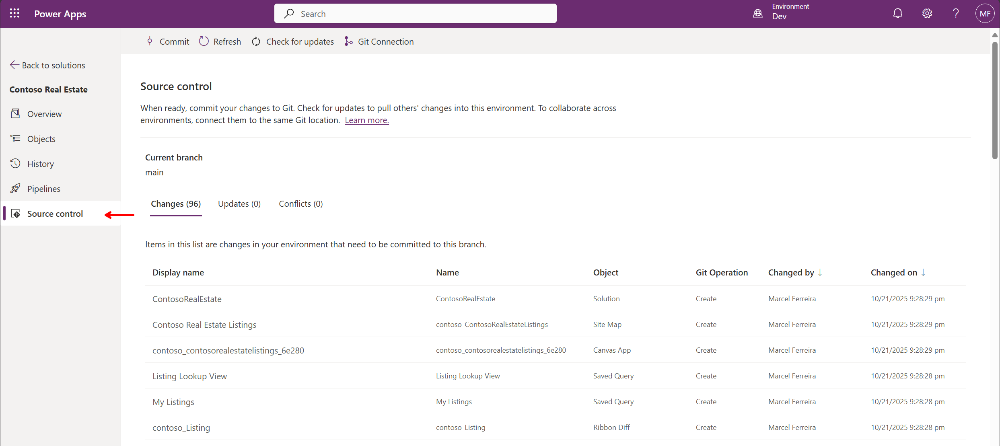
      > **Important:** After setting up Git integration, all the source control components will be processed in the background. During this time, the commit functionality will be disabled. Wait until this process completes before attempting to commit. You'll know it's ready when the commit button becomes active.
      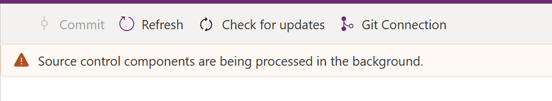
   - Click **Commit** in the ribbon
   - Add a commit message: "Initial commit of Contoso Real Estate Solution"
   - Click **Commit** to save the solution to your Git repository

   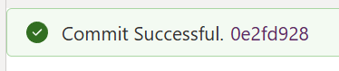

1. **Verify the commit**
   - Check your Git repository to confirm the solution files were committed
   - Review the folder structure created by the Power Platform Git integration

> **Expected outcome:** Your solution is now imported into your development environment and committed to source control as an unpacked solution format.

---

## ✏️ Task 2: Edit your solution

In this task, we will work with the **Solution Explorer** in the Power Apps maker portal as our reference for source code. You'll learn how changes flow between the maker portal and your Git repository, including how to handle conflicts.

### Step 1: Edit the Canvas App with YAML code

1. **Open the Canvas App from Solution Explorer**
   - Open the solution **Contoso Real Estate**
   - In the Objects, click the Contoso Real Estate Canvas App to edit the canvas app.
   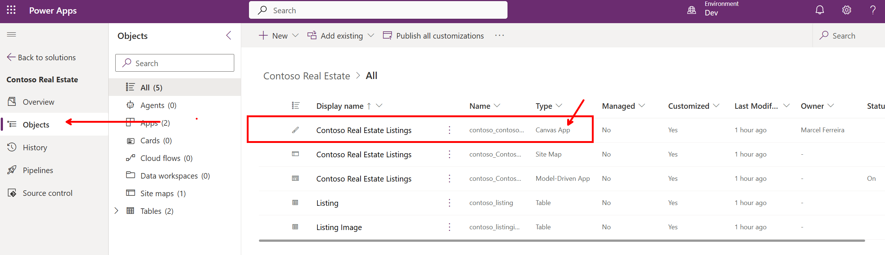
   - You are now in Power Apps Studio

1. **Import YAML code snippet**

- Copy the YAML code bellow (or [copy YAML file from GitHub](https://github.com/microsoft/PPCC25-ALM/blob/main/docs/labs/lab2/assets/screens.pa.yaml))

```yaml
Screens:
  scrALM:
    Children:
      - ScreenContainer4:
          Control: GroupContainer@1.3.0
          Variant: AutoLayout
          Properties:
            Fill: =RGBA(245, 245, 245, 1)
            Height: =Parent.Height
            LayoutAlignItems: =LayoutAlignItems.Stretch
            LayoutDirection: =LayoutDirection.Vertical
            LayoutGap: =16
            PaddingBottom: =16
            PaddingLeft: =16
            PaddingRight: =16
            PaddingTop: =16
            Width: =Parent.Width
          Children:
            - MainContainer3:
                Control: GroupContainer@1.3.0
                Variant: AutoLayout
                Properties:
                  Fill: =RGBA(255, 255, 255, 1)
                  LayoutDirection: =LayoutDirection.Vertical
                  RadiusBottomLeft: =8
                  RadiusBottomRight: =8
                  RadiusTopLeft: =8
                  RadiusTopRight: =8
                Children:
                  - LinkCanvas1:
                      Control: Link@0.0.45
                      Properties:
                        Align: =Align.Center
                        AlignInContainer: =AlignInContainer.Stretch
                        Appearance: ='LinkCanvas.Appearance'.Default
                        AutoHeight: =true
                        FillPortions: =1
                        FontSize: =52
                        LayoutMinHeight: =72
                        Text: ="aka.ms/PPCC25-ALM"
                        URL: ="https://aka.ms/PPCC25-ALM"
                        VerticalAlign: =VerticalAlign.Middle
  scrCommunityYAML:
    Children:
      - ScreenContainer3:
          Control: GroupContainer@1.3.0
          Variant: AutoLayout
          Properties:
            Fill: =RGBA(245, 245, 245, 1)
            Height: =Parent.Height
            LayoutAlignItems: =LayoutAlignItems.Stretch
            LayoutDirection: =LayoutDirection.Vertical
            LayoutGap: =16
            PaddingBottom: =16
            PaddingLeft: =16
            PaddingRight: =16
            PaddingTop: =16
            Width: =Parent.Width
          Children:
            - HeaderContainer2:
                Control: GroupContainer@1.3.0
                Variant: AutoLayout
                Properties:
                  Fill: =RGBA(255, 255, 255, 1)
                  FillPortions: =0
                  Height: =75
                  LayoutDirection: =LayoutDirection.Horizontal
                  RadiusBottomLeft: =8
                  RadiusBottomRight: =8
                  RadiusTopLeft: =8
                  RadiusTopRight: =8
                Children:
                  - TextCanvas3_2:
                      Control: Text@0.0.51
                      Properties:
                        Height: =40
                        Size: =24
                        Text: "=If(\n        Hour(Now()) >= 6 && Hour(Now()) < 12, \"\U0001F324️  Good Morning, \",\n        Hour(Now()) >= 12 && Hour(Now()) < 18, \"☀️  Good Afternoon, \",\n        \"\U0001F319  Good Night, \")\n & Left(User().FullName, Find(\" \", User().FullName) - 1)\n "
                        Weight: ='TextCanvas.Weight'.Semibold
                        Width: =500
            - MainContainer2:
                Control: GroupContainer@1.3.0
                Variant: AutoLayout
                Properties:
                  Fill: =RGBA(255, 255, 255, 1)
                  LayoutDirection: =LayoutDirection.Vertical
                  RadiusBottomLeft: =8
                  RadiusBottomRight: =8
                  RadiusTopLeft: =8
                  RadiusTopRight: =8
                Children:
                  - LoaingImage:
                      Control: Image@2.2.3
                      Properties:
                        DisplayMode: =DisplayMode.View
                        Fill: =RGBA(56, 96, 178, 0.1)
                        Height: =Parent.Height
                        Image: |
                          =$"data:image/svg+xml;utf-8, {EncodeUrl("<svg xmlns='http://www.w3.org/2000/svg' width='100%' height='100%' viewBox='0 0 100 100'>

                          <style>
                              .loading-text {
                                  font-family: Arial, sans-serif;
                                  font-size: 5px;
                                  font-weight: bold;
                                  fill: red;
                                  text-anchor: middle;
                              }
                              .spinner {
                                  animation: rotate 2s linear infinite;
                                  transform-origin: 50px 50px;
                              }
                              @keyframes rotate {
                                  0% { transform: rotate(0deg); }
                                  100% { transform: rotate(360deg); }
                              }
                              .track {
                                  fill: none;
                                  stroke: #ccc;
                                  stroke-width: 3;
                              }
                              .circle {
                                  fill: none;
                                  stroke: #010069;
                                  stroke-width: 3;
                                  stroke-linecap: round;
                                  stroke-dasharray: 45, 100;
                                  stroke-dashoffset: 0;
                                  animation: dash 1.5s ease-in-out infinite;
                              }
                              @keyframes dash {
                                  0% { stroke-dasharray: 1, 100; stroke-dashoffset: 0; }
                                  50% { stroke-dasharray: 45, 100; stroke-dashoffset: -25; }
                                  100% { stroke-dasharray: 45, 100; stroke-dashoffset: -75; }
                              }
                          </style>

                          <!-- Bold red loading text ABOVE the circle -->
                          <text x='50' y='25' class='loading-text'>Loading, please wait</text>

                          <!-- Smaller static circle track -->
                          <circle class='track' cx='50' cy='50' r='15'></circle>

                          <!-- Smaller spinning progress circle -->
                          <g class='spinner'>
                              <circle class='circle' cx='50' cy='50' r='15'></circle>
                          </g>

                          </svg>")}"
                        Transparency: =
                        Width: =Parent.Width
            - FooterContainer1:
                Control: GroupContainer@1.3.0
                Variant: AutoLayout
                Properties:
                  Fill: =RGBA(255, 255, 255, 1)
                  FillPortions: =0
                  Height: =75
                  LayoutDirection: =LayoutDirection.Horizontal
                  RadiusBottomLeft: =8
                  RadiusBottomRight: =8
                  RadiusTopLeft: =8
                  RadiusTopRight: =8
                Children:
                  - cntCurrentTime:
                      Control: GroupContainer@1.3.0
                      Variant: ManualLayout
                      Properties:
                        DropShadow: =DropShadow.None
                        Height: =97
                        RadiusBottomLeft: =0
                        RadiusBottomRight: =0
                        RadiusTopLeft: =0
                        RadiusTopRight: =0
                        Width: =333
                        X: =363
                        Y: =318
                      Children:
                        - lblCurrentTime:
                            Control: Label@2.5.1
                            Properties:
                              Align: =Align.Center
                              Color: =RGBA(9, 33, 98, 1)
                              FontWeight: =FontWeight.Semibold
                              Height: =Parent.Height
                              Size: =19
                              Text: |
                                ="Current Time: " & Text(nowTime, "h:mm AM/PM", "en-US")
                              Width: =Parent.Width
                        - tmrCurrentTime:
                            Control: Timer@2.1.0
                            Properties:
                              AutoPause: =false
                              AutoStart: =true
                              Duration: =1000
                              OnTimerStart: =Set(nowTime, Now())
                              Repeat: =true
                              Visible: =false
```

- Select any screen to paste the YAML snippet.
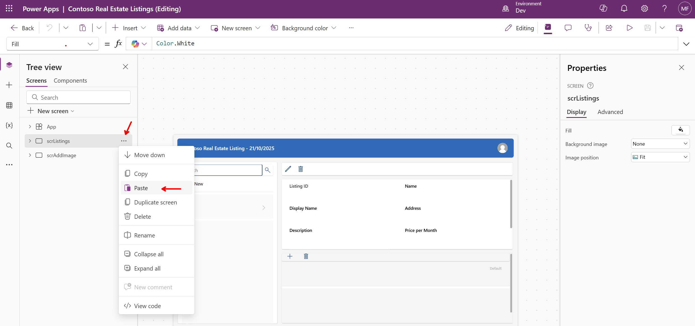

- Two new screens should be added. scrALM and scrCommunityYAML
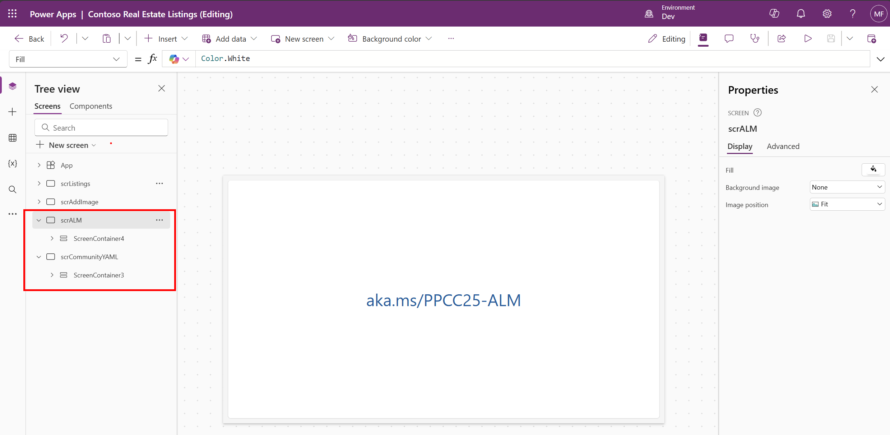

### Step 2: Save, publish and commit changes

Now that you've made changes to your canvas app, you'll save those changes locally, publish them to make them live, and then commit them to your Git repository to preserve the changes in source control.

1. **Save the app**
   - Click **Save** in the app designer
   - Add a meaningful save comment

1. **Publish the app**
   - Click **Publish** to make changes available
   - Confirm the publication
   - **Important:** Only published apps are available to be committed. You must publish before you can commit changes to the repository.
   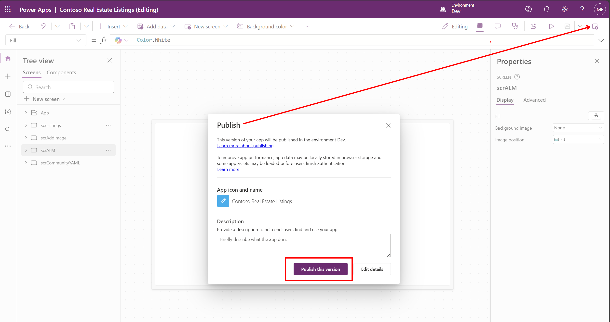
   - Click Back, to go back to solution explorer

1. **Commit to repository**
   - Go to **Source control** tab in your solution
   - Add commit message: "Updated canvas app with new YAML snippet"
   - Click **Commit**
   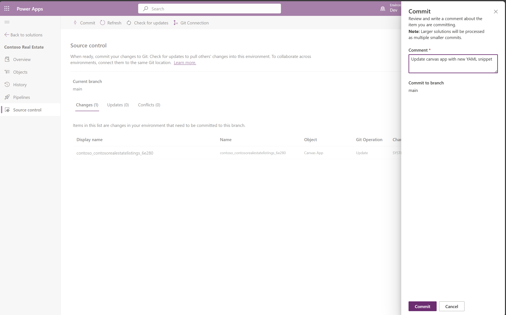

1. **Review the changes in Azure DevOps**
   - Click in the link in the message "Commit Successful.
   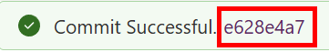
   - Review the committed files and changes.
   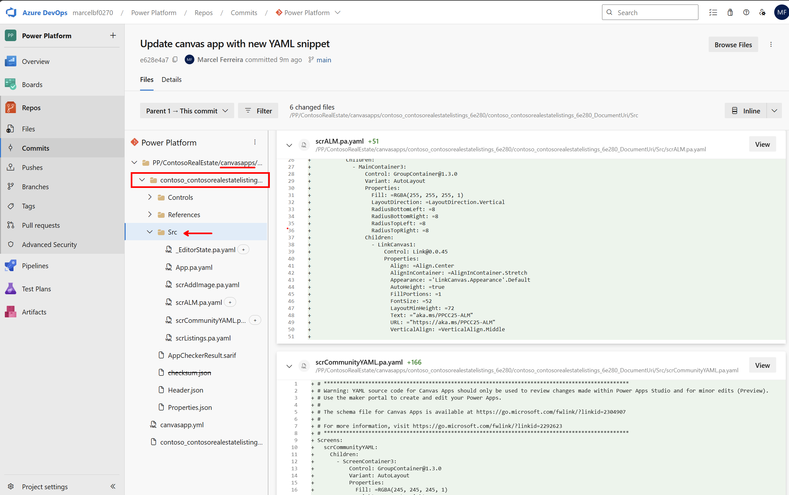

> **Key takeaway:** You have successfully used the maker portal to commit and update your source code in Azure DevOps. Your changes are now version controlled and available for collaboration.

### Step 3: Make changes from the repository using vscode.dev

Professional developers often use specialized tools to compare, review, and make changes directly to the repository. In this step, we'll use VS Code (via vscode.dev) to demonstrate how developers can work with the unpacked solution files directly in source control, making targeted changes to YAML files without going through the maker portal.

1. **Open repository in vscode.dev**
   - Using your browser, navigate to 'vscode.dev'
   - Select **Open Remote Repository**
   - Select **Open Repository from Azure DevOps**
   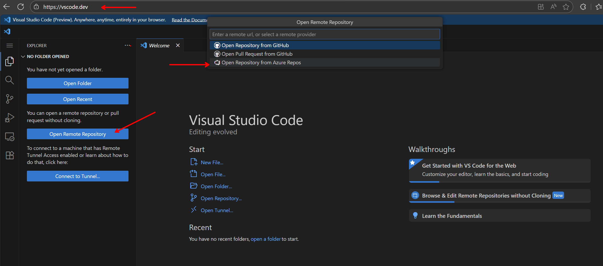
   - Use **your lab user** to sign in
   - Chose your organization and your repository
   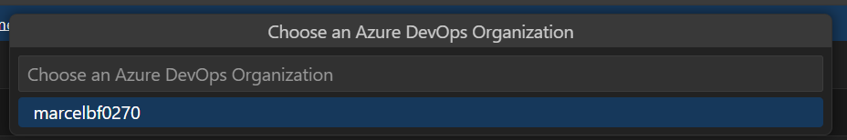
   - Use explorer to navigate on your repository

1. **Find and edit YAML files**
   - Navigate PP -> ContosoRealEstate -> Canvasapps -> your app name
   - locate the Src folder
   - select the file **scrALM.pa.yaml**
   - Locate a YAML file (e.g., screen configuration)
   - Make a minor change (update the property **Text** to **"TEXT UPDATED FROM MY REPOSITORY"**)
   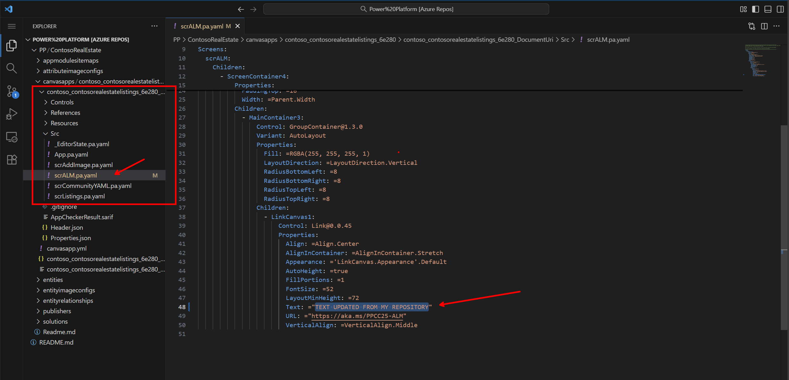

### Step 4: Commit changes using VS Code

1. **Stage and commit changes**
   - Use the Source Control panel in vscode.dev
   - Stage your changes
   - Add commit message: "Minor YAML update from repository"
   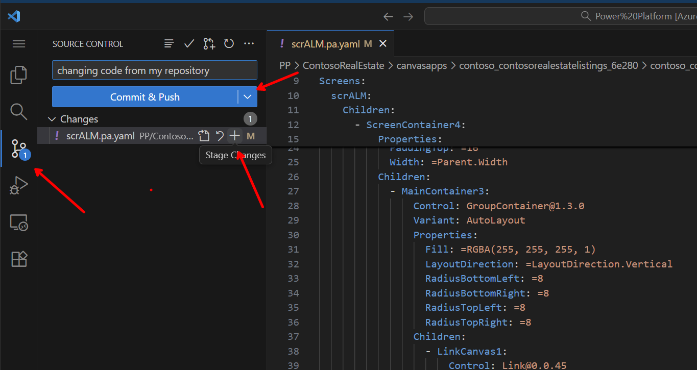
   - Commit and push changes

### Step 5: Reverse sync - Get changes from repository

**Important concepts:**

- **Reverse Sync**: Getting code changes from the repository back into your maker portal environment
- **Source of Truth**: In conflict situations, you must decide whether the repository or maker portal version is correct
- **No merging**: Unlike traditional code, you don't merge Power Platform conflicts - you choose one source as authoritative

1. **Perform reverse sync in maker portal**
   - Return to your solution in Power Apps maker portal
   - Go to **Source control** tab
   - Click **Check for updates** to bring changes in your repository.
   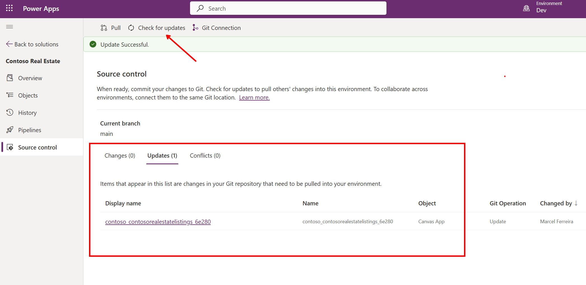
   - Review the incoming changes
   - Click Pull to bring the changes

   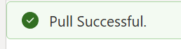

1. **Verify changes applied**
   - Open the canvas app to confirm your repository changes are reflected
   - Check that the YAML modifications are visible
   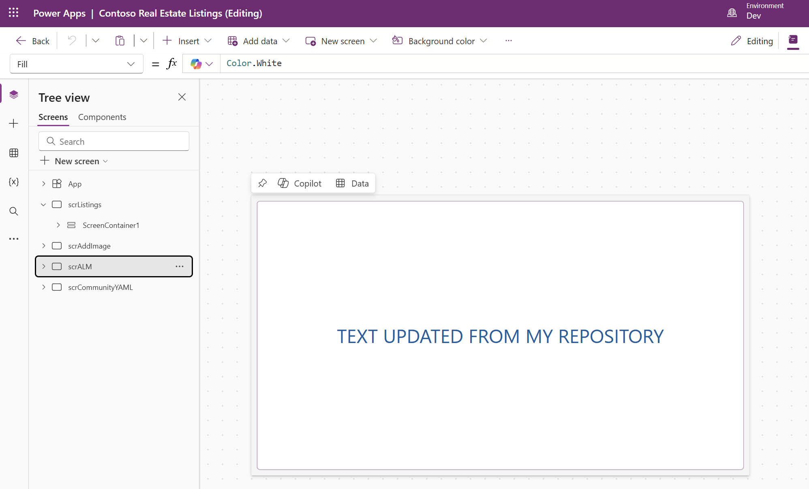

### Step 6: Create a conflict scenario

1. **Make simultaneous changes**
   - **In maker portal**: Edit the same canvas app element you modified in the repo. Save and publish the app.
   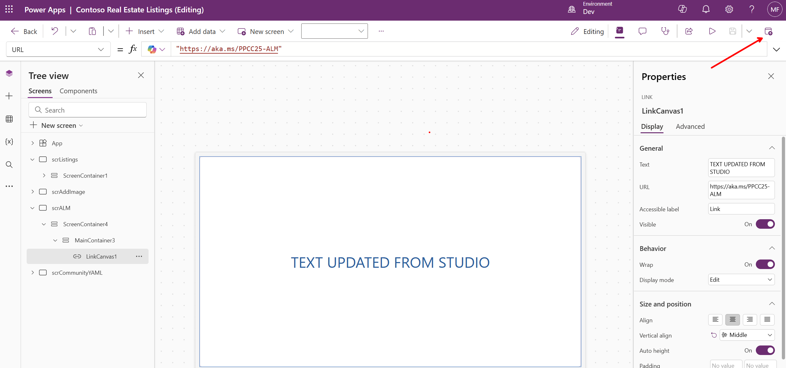
   - DON'T COMMIT (we want to keep the repository out of sync)

   - **In repository**: Using vscode.dev, make a different change to the same YAML property
   - Commit from VSCODE only.
   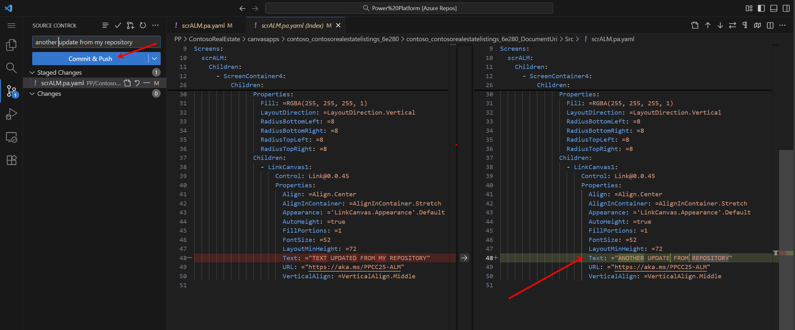

   Now, go back to maker portal, open your solution and **Check for updates** from your repo.

   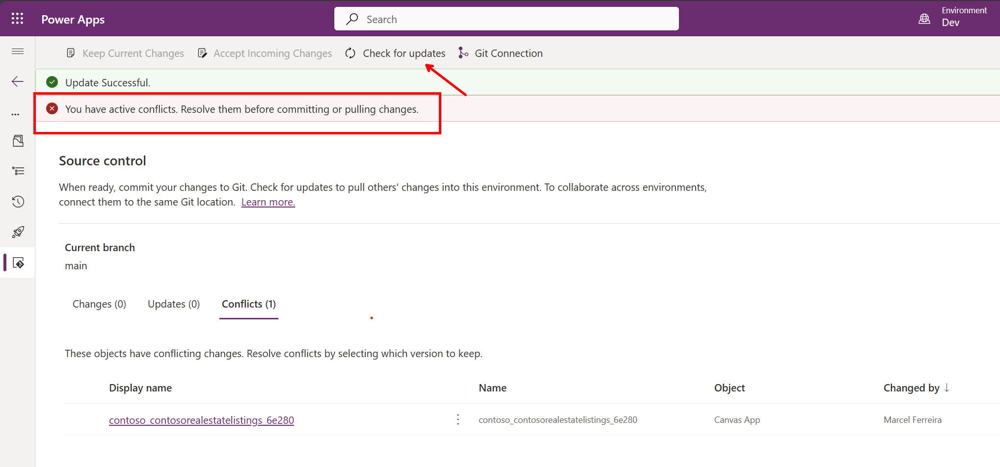

1. **Handle the conflict**
You can choose how you will handle this conflict.
   - If you decide to keep changes from your environment, select **Keep current changes**.
      - You will still need to commit your changes to update the repository. This will override the changes that were made directly in the repository.
   - If you decide to take the changes from your reporitory, select **Accept Incoming Changes**
      - This will discard the changes from your environment. After that, select **Pull** to bring the changes from the repository into your environment.

**Scenario:** You've now simulated a real-world development situation where two developers are working on the same solution simultaneously:

- A **maker** used the Power Apps portal to modify the canvas app
- A **pro developer** used VS Code to make changes directly to the repository

This demonstrates why maintaining a **1:1 relationship between environment and branch** is critical - two developers should not work on the same branch, as changes made in parallel can conflict. Now we'll see how to bring the developer's changes back into the maker portal.

- **Important**: You'll need to choose your source of truth
- **Repository wins**: Accept repository version (recommended for team scenarios)
- **Maker portal wins**: Keep maker portal version and commit over repository

1. **Resolution strategy**
   - Decide on your source of truth based on context
   - Communicate with team about the chosen resolution
   - Document the decision for future reference

> **Expected outcome:** You understand how to work with both maker portal and repository, handle reverse sync, and resolve conflicts by choosing a source of truth.
> **Key learning**: More complex merge scenarios and team collaboration patterns will be covered in the next lab.

---

## 👥 Task 3: Work as a team in multiple environments

In this task, we will simulate team development using multiple Power Platform environments. This demonstrates how different developers can work on the same solution using separate development environments while maintaining code synchronization through Git.

**Prerequisites:** You'll need access to a second development environment for this exercise. We will call this environment **Hotfix**

### Step 1: Set up the Hotfix environment

1. **Export your Contoso Real Estate solution from Dev environment**
   - In the Power Apps maker portal, make sure you're in your **Dev** environment
   - Click **Solutions** in the left navigation
   - Select the **Contoso Real Estate** solution
   - Click **Export** in the top menu
   - In the dialog "Before you export", click **Publish**.
   - Click next.
   - In the export dialog, select **Unmanaged** solution type
   - Click **Export**
   - Wait for the solution to be prepared (this may take a few moments)
   - The solution will download as a `.zip` file to your computer
   - Save this file in an easily accessible location

1. **Switch to your Hotfix environment**
   - In the Power Apps maker portal, use the environment selector
   - Choose your Hotfix environment
   - If you don't have one, create a new developer environment

1. **Import the solution into Hotfix environment**
   - Click **Solutions** > **Import solution**
   - Click **Browse** and select the solution `.zip` file you just exported from your Dev environment
   - Click **Next**
   - Review the solution information
   - Click **Import** and wait for completion
   > **Note:** You're importing the exported solution from your Dev environment which includes all your recent changes. This allows you to have a consistent starting point in the HotFix environment for testing multi-environment workflows.

### Step 2: Connect Hotfix Environment to Git repository with a new branch

Now we'll create a new Git branch from the main branch to work in an isolated environment. This simulates a hotfix scenario where you need to make urgent production fixes without impacting ongoing development work.

1. **In your hotfix environment**
   - Open the Solution **Contoso Real Estate**
   - Select **Source control**
   - Click connect
   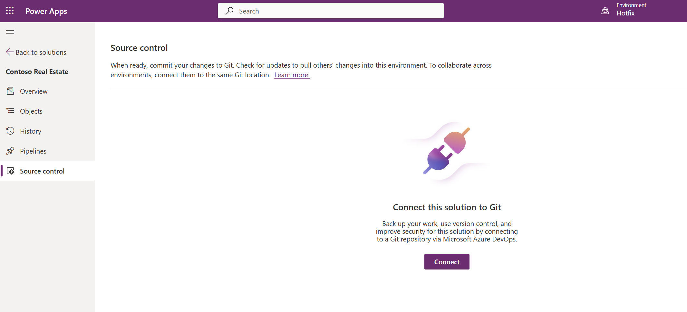
   - select the options bellow:
   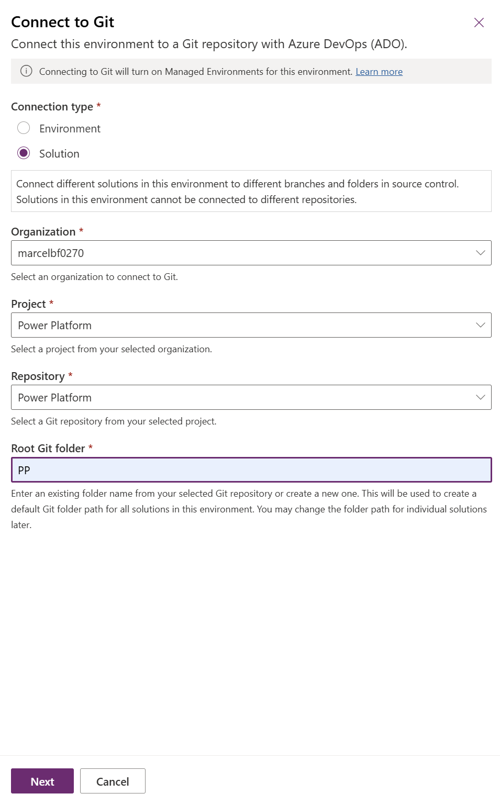
   - In the next screen, select **Create new branch**
   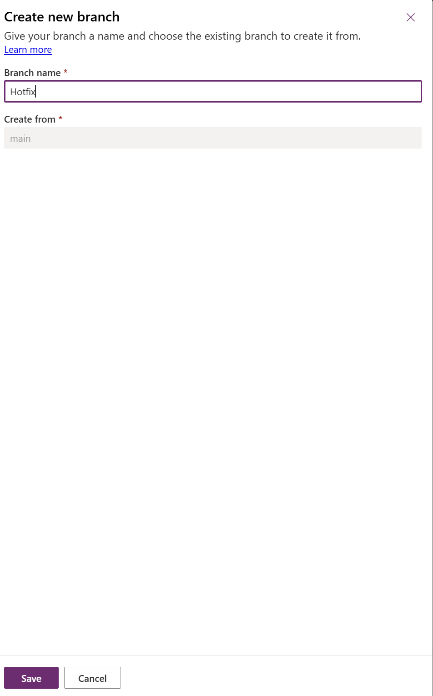
   - Click connect to complete
   - Wait until all the changes in the environment are processed.
   - Select **Check for updates**, to compare your environment with the content from your repo.
   - If you have conflicts, select all conflicts, and click **Accept Incoming Changes**
   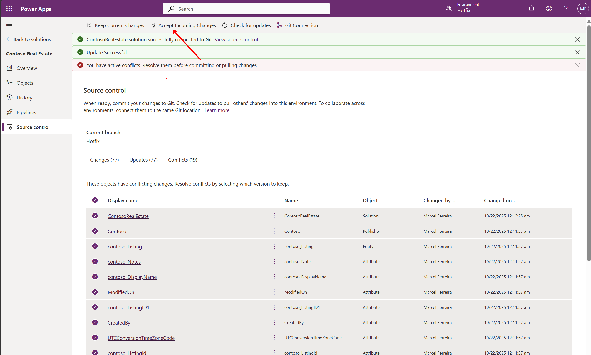
   - Confirm you want to accept the changes from your repository.
   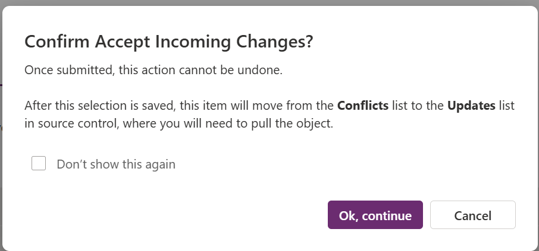
   - Click **Pull** to apply the changes from your repository to your environment.

**Important concept:** In Power Platform, we recommend maintaining a **1:1 relationship between environment and branch**. Each development environment should be connected to its own dedicated Git branch for clean separation of work.

### Step 4: Make changes in Hotfix Environment

In this step, you'll simulate a hotfix scenario by making a critical update to the canvas app in your HotFix environment. Since the HotFix branch is isolated from your main development branch, you can work independently and commit changes without affecting ongoing development work.

1. **Open the solution in the HotFix environment**
   - In the HotFix environment, navigate to your imported solution
   - Find and open the Canvas app component
   - This is the base version without your previous development changes

1. **Make a hotfix change to the canvas app**
   - Open the Canvas app in edit mode
   - Make a targeted change that simulates a production hotfix (e.g., fix a button label, update a formula, or correct text)
   - Keep the change focused and minimal, as hotfixes typically target specific issues
   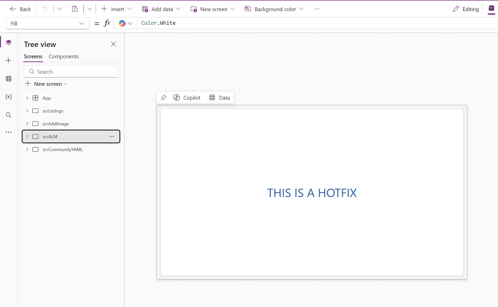

1. **Save the app**
   - Click **Save** in the app designer
   - Add a meaningful save comment that describes the hotfix (e.g., "Hotfix: Corrected button text")

1. **Publish the app**
   - Click **Publish** to make the changes available
   - Confirm the publication
   - **Important:** Only published apps are available to be committed. You must publish before you can commit changes to the repository.

1. **Commit the hotfix to your HotFix branch**
   - Go to **Source control** tab in your solution
   - Add a commit message: "Hotfix: [description of the fix]"
   - Click **Commit** to save the changes to your HotFix branch in the repository
   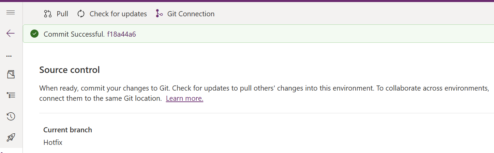

1. **Verify the hotfix commit in Azure DevOps**
   - Navigate to your Azure DevOps repository
   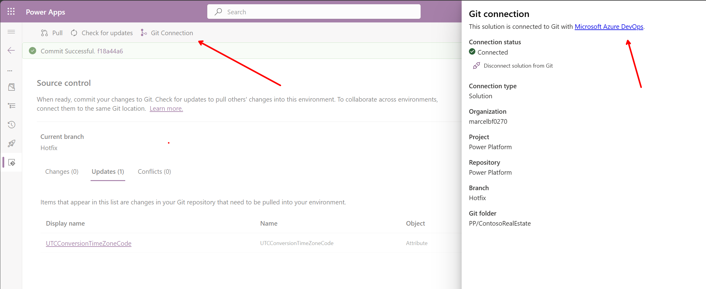
   - You should be in the **Hotfix** branch. Select **Create pull request** to send changes to main
   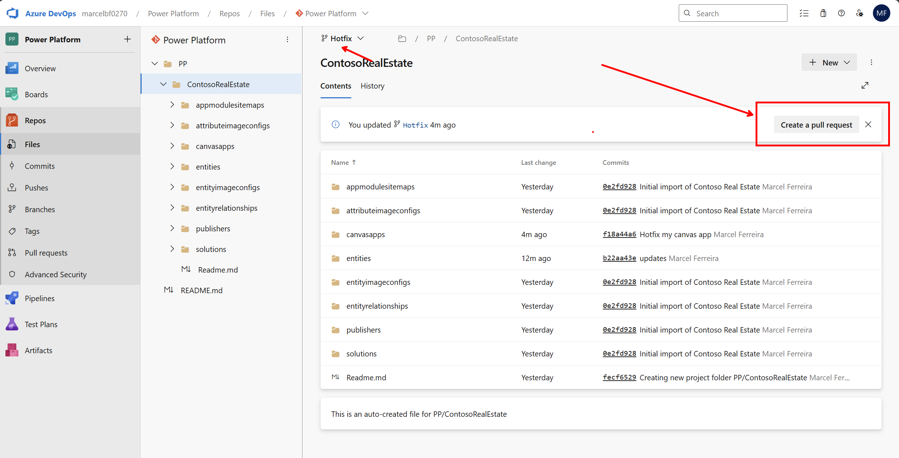
   - Add title and description, and click create.
   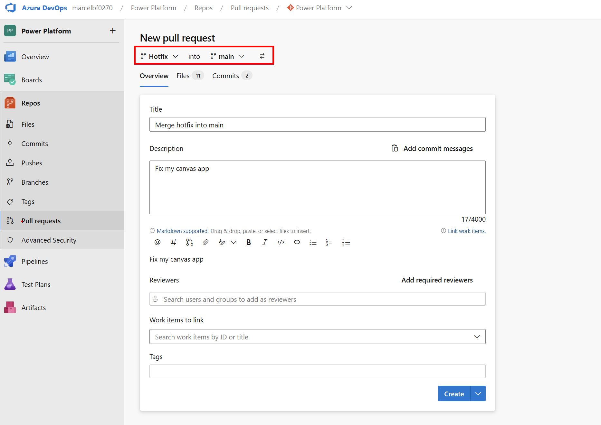
   - You should have no merge conflicts. Complete the PR.
   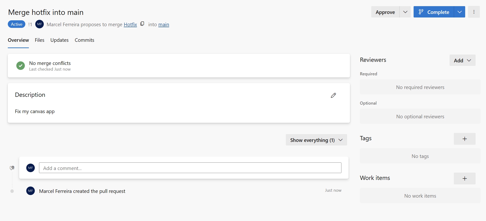

1. **Update your dev environment with hotfix from repository**
   - In the Dev environment, navigate to the Contoso Real Estate solution.
   - Navigate to Source Control.
   - Click **Check for updates**
   - Pull the changes
   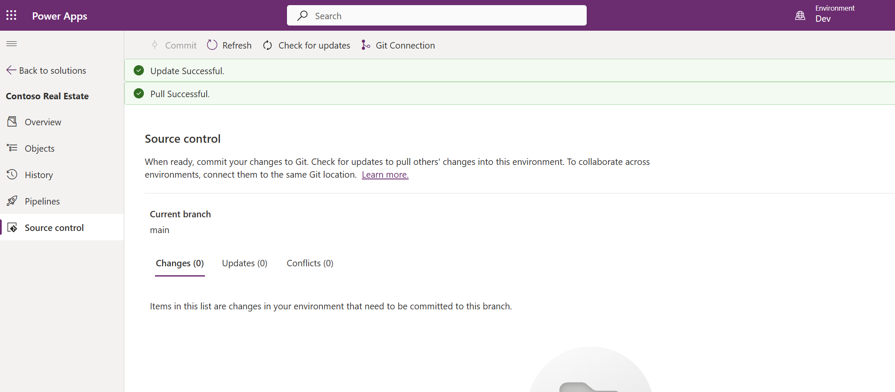
   - You should have the hotfix now. Open your canvas app to confirm
   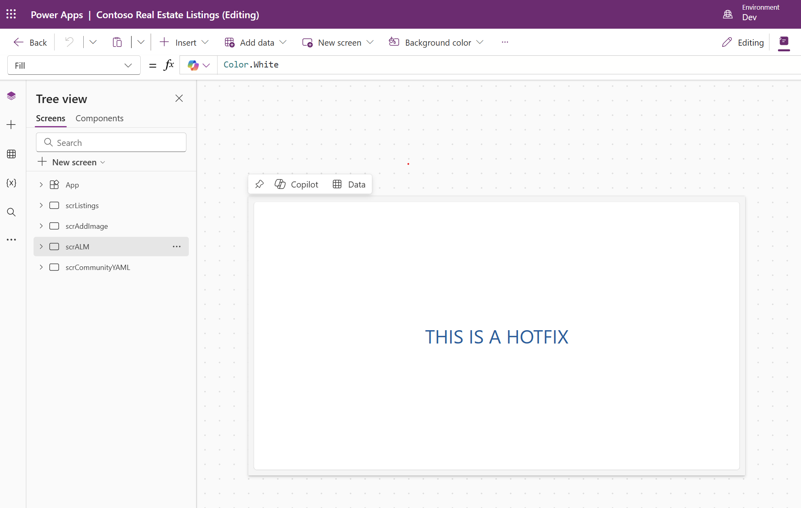

> **Expected outcome:** You've successfully created an isolated hotfix in a separate branch, demonstrating how to handle urgent production fixes without impacting ongoing development work.
> **Key learning:** The 1:1 environment-to-branch relationship keeps development organized and makes it easier to track which changes come from which developer or environment.

---

## 🤖 Task 4: Create a new agent

In this final task, we will create a Microsoft Copilot Studio (MCS) agent and configure it to use Dataverse tables as a knowledge source. This demonstrates how AI agents integrate into the Power Platform ALM lifecycle alongside apps and flows. To make the agent ALM-ready, we'll create it within a solution from the start.

### Step 1: Navigate to Copilot Studio in the correct environment

1. **Verify your Power Apps environment ID**
   - Navigate to [make.powerapps.com](https://make.powerapps.com)
   - Switch to your **Hotfix** environment
   - Look at your browser's URL - it should look like:

     ```text
     https://make.powerapps.com/environments/12345678-1234-1234-1234-123456789abc/apps
     ```

   - Copy the environment ID from the URL (the GUID between `/environments/` and `/apps`)
   - **Example**: If your URL is `https://make.powerapps.com/environments/12345678-1234-1234-1234-123456789abc/apps`, your environment ID is `12345678-1234-1234-1234-123456789abc`

1. **Navigate to Copilot Studio with the correct environment**
   - Open a new browser tab
   - Navigate to Copilot Studio using your environment ID:

     ```text
     https://copilotstudio.microsoft.com/environments/YOUR-ENVIRONMENT-ID-HERE
     ```

   - Replace `YOUR-ENVIRONMENT-ID-HERE` with the environment ID you copied from Power Apps
   - **Example**: `https://copilotstudio.microsoft.com/environments/12345678-1234-1234-1234-123456789abc`
   - Verify you're in the correct environment by checking the environment name displayed in Copilot Studio

   > **Note**: If you don't see the environment ID in the Copilot Studio URL, you may not be in the correct environment. Go back to Power Apps, copy the environment ID again, and update the Copilot Studio URL accordingly.

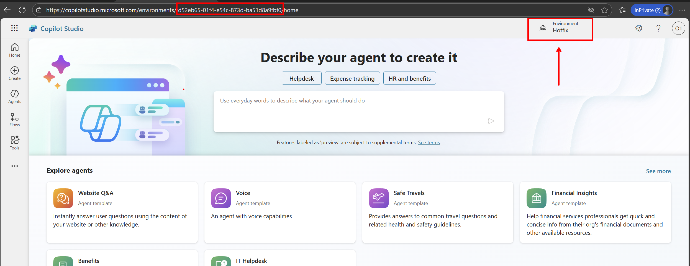

### Step 2: Set up the solution for ALM

To make your agent ALM-ready, it must be created within a solution. This enables version control, deployment across environments, and integration with Git.

1. **Navigate to the Solutions area**
   - In Copilot Studio, click on **Solutions** in the left navigation
   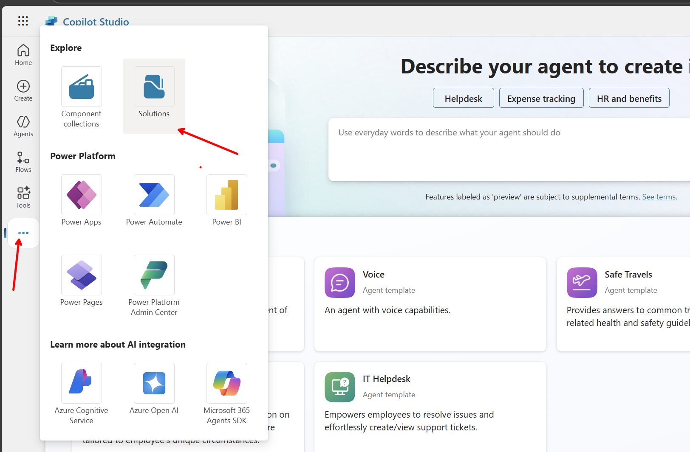
   - You should see the **Contoso Real Estate** solution that you've been working with in previous tasks

1. **Set the Contoso Real Estate solution as the preferred solution**
   - In the ribbon, select **Set preferred solution**
   - Select the Contoso **Real Estate Solution**
   - Apply
   - This ensures that any new components you create will automatically be added to this solution
   

1. **Verify Git integration is connected**
   - Click on the **Contoso Real Estate** solution to open it
   - Check that the solution shows it's connected to Git (you should see a Git status indicator or source control option)

   > **Important**: The solution must be connected to Git integration to enable source control for your agent. This allows you to commit agent changes alongside other solution components.

1. **Navigate back to the Copilot Studio home page**
   - Click the **Copilot Studio icon** in the top left corner of the screen to return to the home page
   - This will take you back to the main Copilot Studio interface where you can create new agents

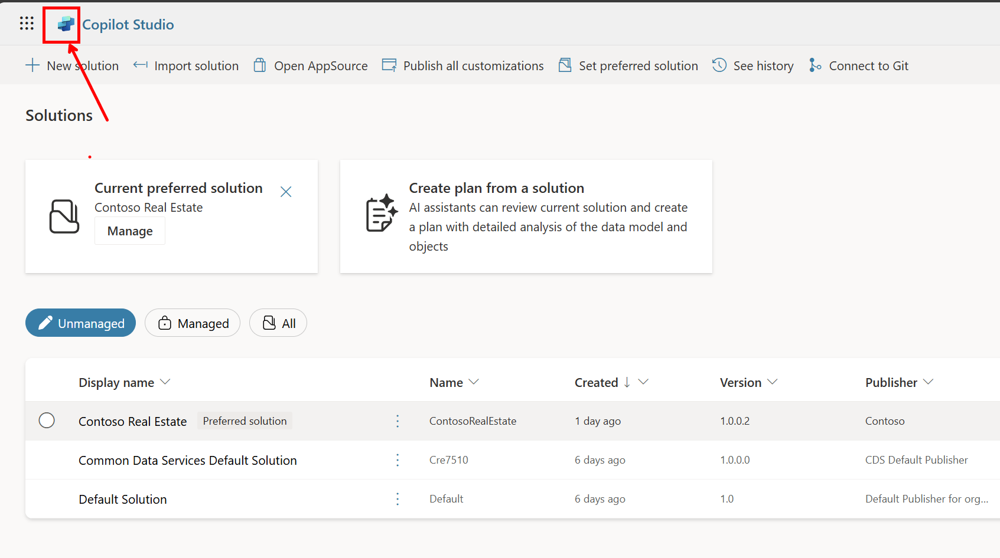

### Step 3: Create a new Copilot Studio agent

1. **Use the chat to create your agent**
   - From the Copilot Studio home page, describe the agent we will create:

   ```yaml
   “I want to build an agent that helps real estate agents to find properties. When the agent describes a property, the agent will ask for specific features and a budget.”
   ```

   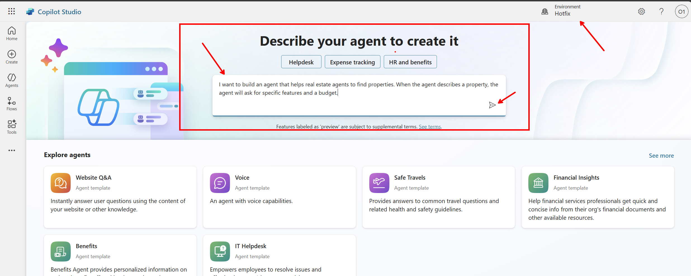

   - Because you set the Contoso Real Estate solution as your preferred solution, the agent will automatically be added to this solution

1. **Configure the agent**

   The conversational creation experience with Copilot will next load. You'll see Copilot is in progress of responding to you.
   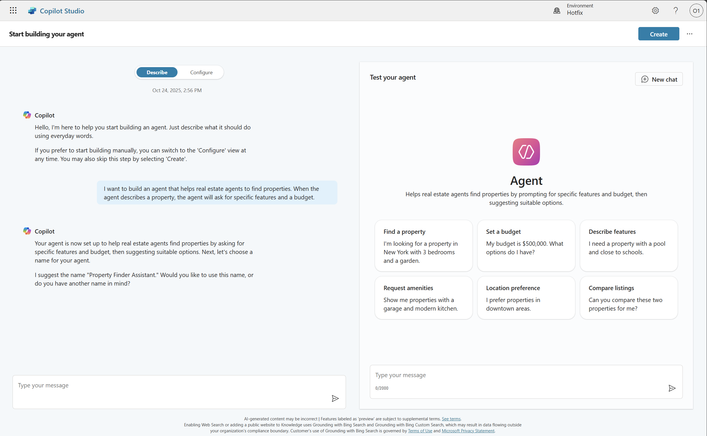

   - Click Configure
   - **Name**: Property finder assistant.
   - Review the description and instructions generated.
   - Click **Create** to initialize the agent

   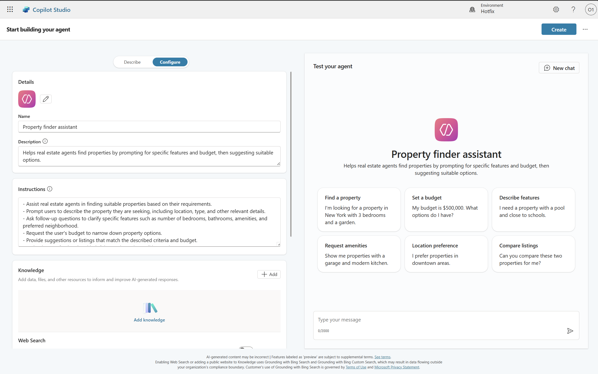

   - Wait until your agent is provisioned.
   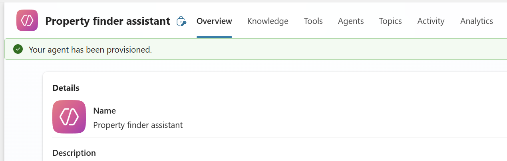

### Step 4: Add Dataverse tables as knowledge source

1. **Access Knowledge sources**
   - In your agent, navigate to the **Knowledge** section
   - Click **+ Add knowledge**
   - Select **Dataverse** as the knowledge source type
   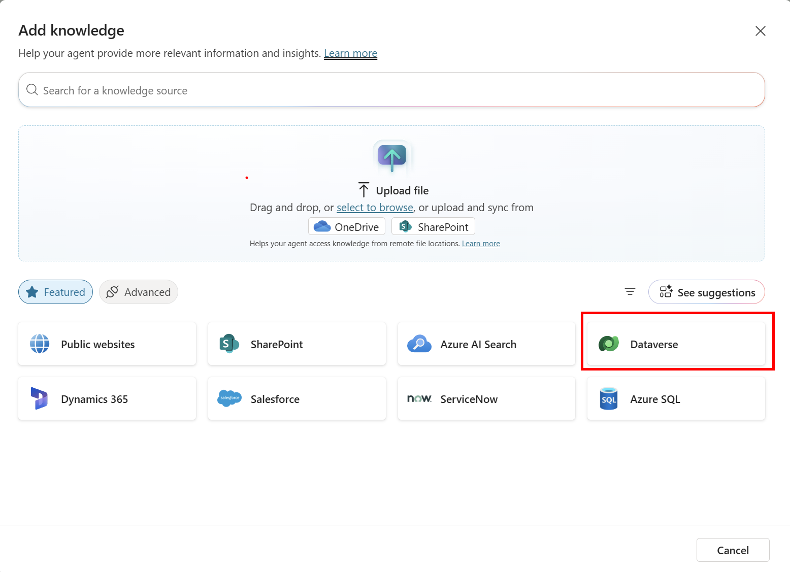
   - Choose the **Listing** table and click "Add to agent"
   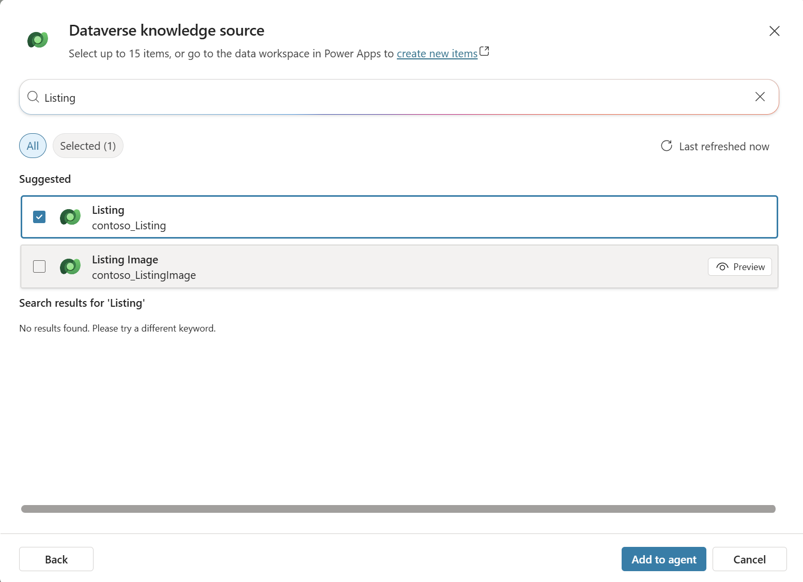

### Step 5: Test the agent with Dataverse knowledge

1. **Test knowledge integration**
   - Use the **Test** panel in Copilot Studio
   - Ask questions that should trigger responses from your Dataverse tables (e.g., "Show me available properties" or "What properties are in the database?")
   - Verify the agent can access and use the table data appropriately
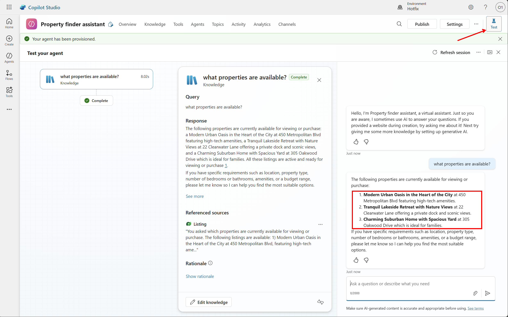

   > **Note**: You can continue to refine the agent and add more components, but for this lab we will focus on the ALM aspect of it. If you want to explore how to build Microsoft Copilot Studio agents in depth, check out the [Agent Academy](https://microsoft.github.io/agent-academy/).

### Step 6: Commit the agent to source control

> **Important**: Normally, you must publish an agent before it can be committed to source control. However, for this lab, we will skip the publish step and commit the agent directly to demonstrate the ALM workflow.

1. **Commit the agent to source control**
   - Navigate back to **Solutions**
   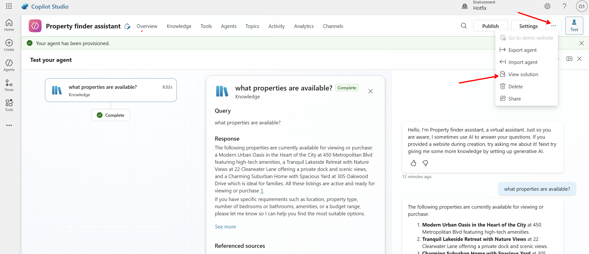
   - Open the **Contoso Real Estate** solution
   - Go to the **Source control** tab
   - You should see the agent files in the pending changes
   - Add commit message: "Added Copilot Studio agent with Dataverse knowledge source"
   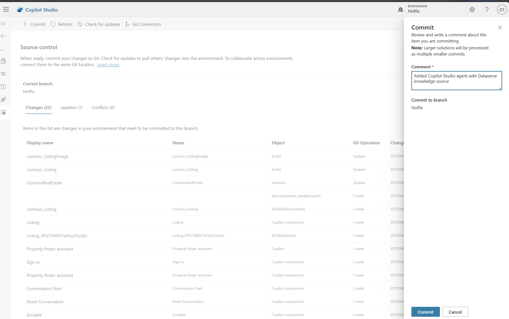
   - Click **Commit**

1. **Verify agent in repository**
   - Check your Git repository in Azure DevOps to see the agent files
   - Review the agent's metadata and configuration files
   - Note how the agent integrates with your overall solution structure

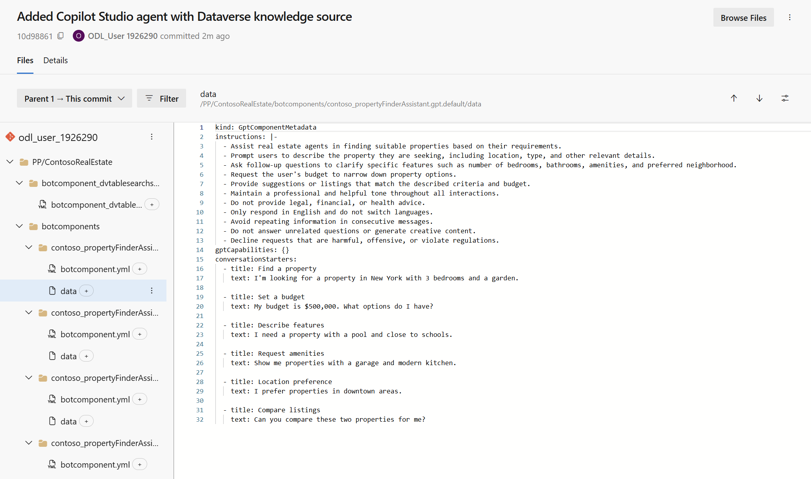

> **Expected outcome:** You have successfully created a Copilot Studio agent within a solution, connected it to Dataverse tables as a knowledge source, and committed it to source control as part of your ALM workflow.
>
> **Key insights:**
>
> - Creating agents within solutions from the start makes them ALM-ready
> - Agents follow the same source control patterns as apps, flows, and other solution components
> - AI agents are now first-class citizens in Power Platform ALM
>
> **Key insights:**
>
> - Creating agents within solutions from the start makes them ALM-ready
> - Agents follow the same source control patterns as apps, flows, and other solution components
> - AI agents are now first-class citizens in Power Platform ALM
