# 🚀 Lab 3: Deploy

A key facet of healthy ALM is separating changes in development from those in testing and in production. Pipelines in Power Platform deploys the latest version of your solution across these environments, with the ability to add secure approvals and review changes before they're deployed. Note: in this lab you'll only deploy from development to production, but in the real world it's recommended to add an additional test stage. Other stages may also be added.

✅ Lab tasks

In this lab, you will go through the following tasks:

1. [Create a Platform Host pipeline](#-task-1-create-a-platform-host-pipeline)
1. [Create a Custom Host pipeline](#-task-2-create-a-custom-host-pipeline)
1. [Extend pipelines](#-task-3-extend-pipelines)
1. [Redeploy a prior version](#-task-4-redeploy-a-prior-version)

---

## 📋 Prerequisites

Complete lab 2.1

If you did not complete lab 2.1, import the ContosoRealEstate_1_0_0_1.zip unmanaged solution in your development environment. This solution is available in your lab materials folder.

---

## 📚 Types of Pipelines

There are two ways to configure Power Pipelines:

**Platform host** - Out of the box tenant-wide pipelines ghosted under a "platform host" configuration. These pipelines are configured by makers for personal use. Personal pipelines cannot be extended, nor can they be shared with other makers in the tenant.

**Custom host** - Pipelines configuration hosted under a custom environment, where Power Pipelines modules are installed by admins. Custom pipelines are centrally governed by admins and shared with makers for use.

---

## 🎯 Task 1: Create a Platform Host pipeline

In this task, you will create a personal Platform Host pipeline for deploying solutions from your development environment to production.

### Step 1: Navigate to your development environment and create a pipeline

1. **Navigate to your development environment**
   - This is where you have built your solution that you would like to deploy to QA and Production

1. **Access the Solutions area**
   - Click on **Solutions** tab in the left-hand navigation blade
   - Once in the Solutions page, open your unmanaged solution which you want to deploy

1. **Open the Pipelines page**
   - On the left-hand navigation panel, click on the rocket icon for Power Pipelines page

1. **Create a new pipeline**
   - On the Pipelines page, select **+ Create new pipeline**

1. **Configure the pipeline**
   - In the Create pipeline pop out wizard, provide the following details:
     - **Name**: <Your Name> Platform Host Pipeline
     - **Description**: Include description of which environments this pipeline will deploy to
     - **Target environment**: select your Production environment (where you enabled ME earlier in this lab)
   - Click **Save**


### Step 2: Deploy using a Platform Host pipeline

You're now ready to use this Pipeline to deploy your solutions! If your specific deployment process requires an additional environment, click on Add Stage button to add additional stages.


1. **Initiate deployment**
   - On the Production environment stage, click **Deploy here** to initiate the solution deployment to production

1. **Schedule deployment (optional)**
   - You can schedule deployments by selecting **Later** in the Deployment Schedule section, and selecting a time and date when you'd like to automatically deploy
   - Click **Next**

1. **Review and deploy**
   - In the summary section, notice the Deployment Notes section was populated using AI-generated summary of your solution's capabilities
   - Click **Deploy** to begin your deployment


1. **Monitor deployment progress**
   - Your Production stage will update with the progress of the deployment:


1. **Verify deployment completion**
   - When the deployment completes, you can see the success message on the stage:

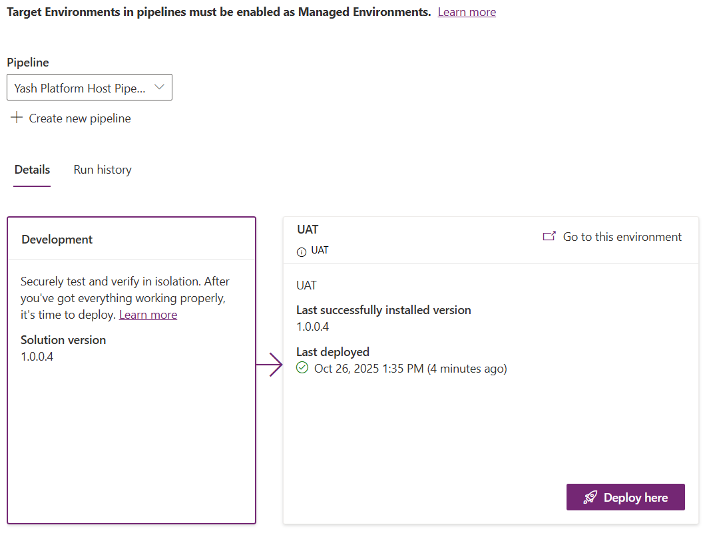

> **Remember**: Platform Host pipelines are not shareable, nor can they be extended to support approvals or delegations. Continue to the Custom Host Pipelines section to create extendable and shareable pipelines.

---

## 🏗️ Task 2: Create a Custom Host pipeline

In this task, you will create a Custom Host pipeline which provides advanced capabilities including approvals, delegations, and sharing with other team members.

### Step 1: Create a Custom Host environment

Let's begin by installing the Power Pipelines modules on a designated Pipeline orchestrator environment. While this module does not have to be installed in a dedicated environment, it is encouraged to do so.

1. **Access Power Platform Admin Center**
   - In the Power Platform Admin Center (https://admin.preview.powerplatform.microsoft.com/) select **Deployments** from the left-hand navigation panel
   - Make sure you are on the **Overview** tab

1. **Create new custom host**
   - Click **+ New custom host** button to kick off a new environment creation with Power Platform Pipelines modules pre-installed

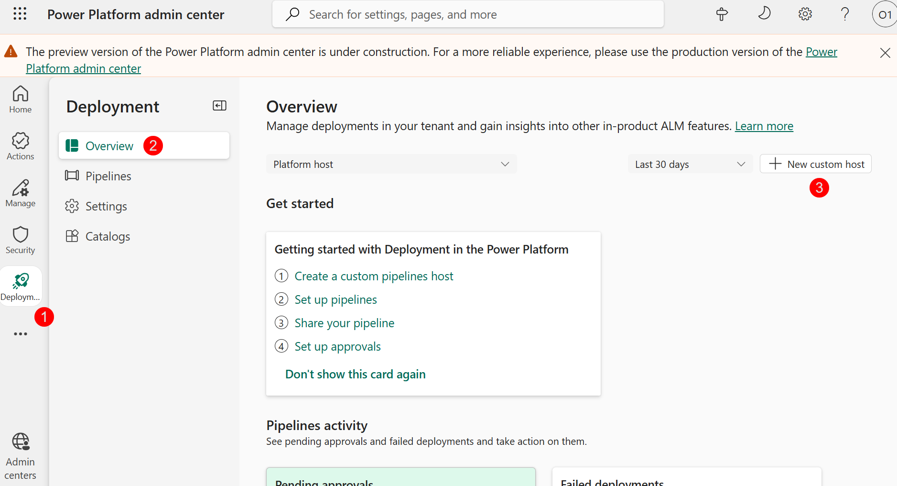

1. **Configure the New Environment**
   - **Name**: "Custom Host Environment"
   - **Make this a Managed Environment**: Yes
   - **Type**: Developer
   - Click **Next**

1. **Configure Security Group**
   - Under Security Group, click **+ Select**, select **None**
   - Click **Save**


Now that the Custom Host Environment is created, we can begin configuring the custom host pipeline. Since the tenants provided for today's lab contain pre-created environments, before we begin, let's first select which environments we will be using for this lab. Please fill out this worksheet for each environment:

**Environment Name**:

**Environment Type**: Dev

**Environment ID**:

**Environment Name**:

**Environment Type**: Target

**Environment ID**:

### Step 2: Configure environment records for the pipeline

1. **Navigate to PowerApps maker portal**
   - Navigate back to PowerApps maker portal at https://make.preview.powerapps.com/
   - In the top right hand corner in the Environment selection dropdown, select the **Custom Host Environment** which you just created

1. **Open Deployment Pipeline Configuration app**
   - Click on the **Apps** tab
   - Click on the **Deployment Pipeline Configuration** app to play it


1. **Access Environments section**
   - In the Deployment Pipeline Configuration app, select **Environments** on the left pane


1. **Create development (source) environment record**
   - Let's create the development (source) environment record. Select **New** in the ribbon to create a new environment record
   - **Name**: <Environment name of the developer env you selected at the beginning of the lab>
   - **Environment Type**: Select **Development** for your source environment
   - **Environment Id**: <Environment ID of the developer env you selected at the beginning of the lab>
   - Click **Save**
   - Wait for one minute, and click **refresh** in the ribbon to verify **Validation Status** equals **Success**


1. **Create target environment record**
   - Let's create the target environment record. Select **New** in the ribbon to create a new environment record
   - **Name**: <Environment name of the developer env you selected at the beginning of the lab>
   - **Environment Type**: Select **Target** for your source environment
   - **Environment Id**: <Environment ID of the target env you selected at the beginning of the lab>
   - Click **Save**
   - Wait for one minute, and click **refresh** in the ribbon to verify **Validation Status** equals **Success**

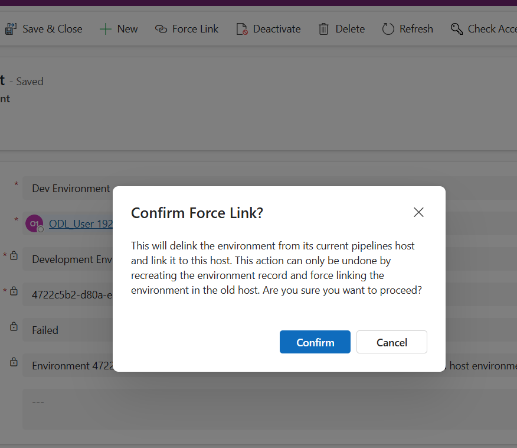

1. **Add additional target environments (if needed)**
   - Repeat step 11 again if you have more than 1 target environment

### Step 3: Configure a basic pipeline

1. **Access Pipelines section**
   - Select **Pipelines** in the left navigation pane

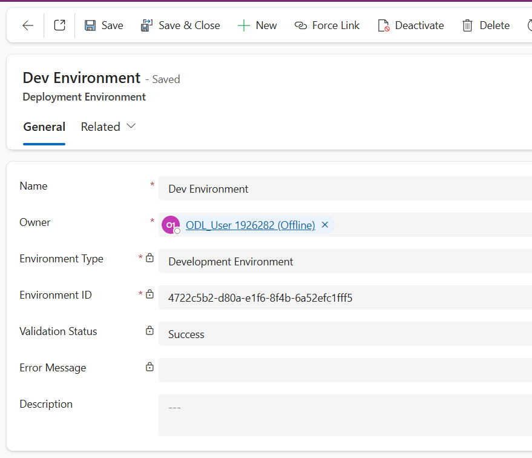

1. **Create new deployment pipeline**
   - Select **New** in the ribbon to create a new deployment pipeline record
   - **Name**: Custom Host Pipeline
   - **Description**: optional, add a description of the purpose this pipeline serves
   - **AI deployment notes**: Enabled
   - **Allow redeployments of older versions**: Enabled
   - **Deployment Type**: Standard
   - Click **Save**


1. **Link development environment**
   - Scroll down to the **Linked Development Environments** grid
   - Click on the three vertical dots on the top right corner of the grid to open additional grid options
   - Select **Add Existing Deployment Environment**, then select the development (source) environment you configured earlier in this lab, then click **Add**

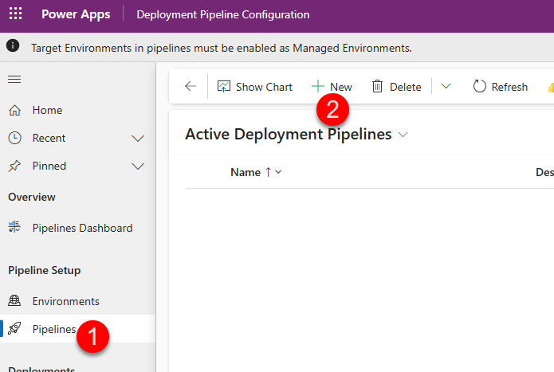

1. **Create deployment stage**
   - In the **Deployment Stages (Deployment pipeline)** grid, select **New Deployment Stage**
   - Complete the form:
     - **Name**: Target Env 1
     - **Description**: optional, add a description of the environment you are deploying to
     - **Previous Deployment Stage**: Leave blank as this will be our first deployment stage
     - **Target Deployment Environment ID**: Select one of the Target environments you configured earlier in this lab
   - Click **Save and Close**

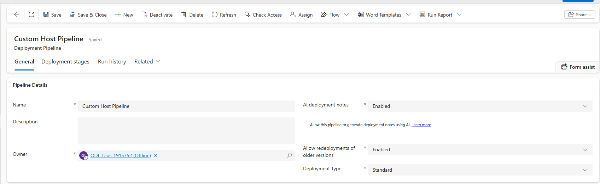

1. **Add additional stages (if needed)**
   - IN the real world, repeat Steps 16 and 17 if you have more than one target environments for your pipeline. With one difference. In Previous Deployment Stage field, select the name of the stage you configured in Step 17.a
   - This pattern can be repeated to add up to 7 deployment stages in your pipeline

> **Congratulations!** You have created a basic Custom Host Pipeline. Go to your development (source) environment, and open any unmanaged solution. Then, click on the Pipelines tab (rocket icon) to open the Pipelines pane. Here, you will see your newly created pipeline:


### Step 4: Deploy Using a Custom Host pipeline

1. **Initiate deployment**
   - Click **Deploy here** button in the Target Env 1 stage
   - You will get a popup which asks you to enable Managed Environments on the target env. Remember, Pipelines are a ME only feature. Your Target environments must be enabled for ME to perform a deployment. Click **Enable managed environment**


1. **Complete the deployment**
   - Follow the same steps you performed in the Deploy Using a Platform Host pipeline section to complete the deployment

So far, the two types of pipelines we've explored enable basic deployments only. However, some processes call for greater control over the deployment process to ensure production assets are kept safe from unintentional or unapproved changes. For example, while administrators have permission to deploy to production, it's important makers and developers do not have elevated access. Or, maybe the process mandates an admin or change manager's approval before a deployment to production can be initiated. Let's configure our pipeline to support these processes.

---

## 🔧 Task 3: Extend pipelines

In this task, you will extend deployment pipelines to add approvals, delegated deployments using service principals, and other advanced capabilities.

### Gated extensions

In this section, we will extend deployment pipelines we created in the sections above. Extending pipelines allows organizations to tailor pipelines to their unique needs. For example, you can add approvals, deploy via service principals, and integrate with internal systems of record, Azure DevOps, GitHub, and much more. Custom steps can be initiated at various stages of the pipeline. These steps are defined by Microsoft Dataverse business events. In Power Pipelines terminology, these initiation stages are called "Gated Extensions." Here are the 3 available gated extensions:

**Pre-export step required**: Allows running custom validation logic when a deployment request is submitted. Pipelines won't export the solution from a development environment until this step is marked as completed. This should only be used on the first stage of the pipeline.

**Pre-deployment step required**: Allows initiation of custom steps after a deployment has been triggered, but before installation begins on the target environment. This gated extension can be used to trigger processes such as approvals before a solution is deployed to the target environment.

**Is delegated deployment**: Carries out deployments using a service principal or pipeline stage owner's identity instead of the requesting maker's identity. This identity ensures makers can request deployments without elevated (or any) access within target environments. Requires approval from an authorized identity.

Each step of a pipeline deployment triggers a real-time event at the beginning and completion of the step for which you can initiate custom logic. Additional triggers are produced when gated extensions are enabled. These correspond to the custom step inserted when an extension is enabled on the pipeline stage.

The tables here indicate triggers and actions required for each extension:

| Gated extension | Step started trigger | Step completed trigger | Unbound action | Connection to use |
|---|---|---|---|---|
| Pre-export step required | OnDeploymentRequested | N/A | UpdatePreExportStepStatus | Any identity with access to update the deployment stage run record |
| Is delegated deployment | OnApprovalStarted | OnDeploymentCompleted | | Create a connection as the service principal or pipeline stage owner as configured on the pipeline stage. The pipeline stage owner must be an owner of the service principal in Microsoft Entra ID. |
| Predeployment step required | OnPreDeploymentStarted | OnPreDeploymentCompleted | UpdatePreDeploymentStepStatus | Any identity with access to update the deployment stage run record |

Now, let's extend the Custom Host pipeline we created to include an Approval step. Once we get the approval, we will perform a Delegated deployment using an Application user.

### Step 1: Create Application User

1. **Navigate to Azure Portal**
   - Navigate to https://portal.azure.com
   - Click on the **Microsoft Entra ID** tile

1. **Create new app registration**
   - Click on **App Registrations** in the navigation blade > click **+ New registration**
   - **Name**: Deployment App User
   - **Supported account types**: Accounts in this organizational directory only (<tenant_name> only - Single tenant)
   - Click on **Register**

1. **Configure API Permissions**
   - Expand the **Manage** tab > click on **API Permissions**
   - Click **+ Add a permission**
   - In the Request API permissions blade, select the following and grant user_impersonation permissions:
     - Azure DevOps
     - Dynamics CRM
   - The configured permissions should looks like this:

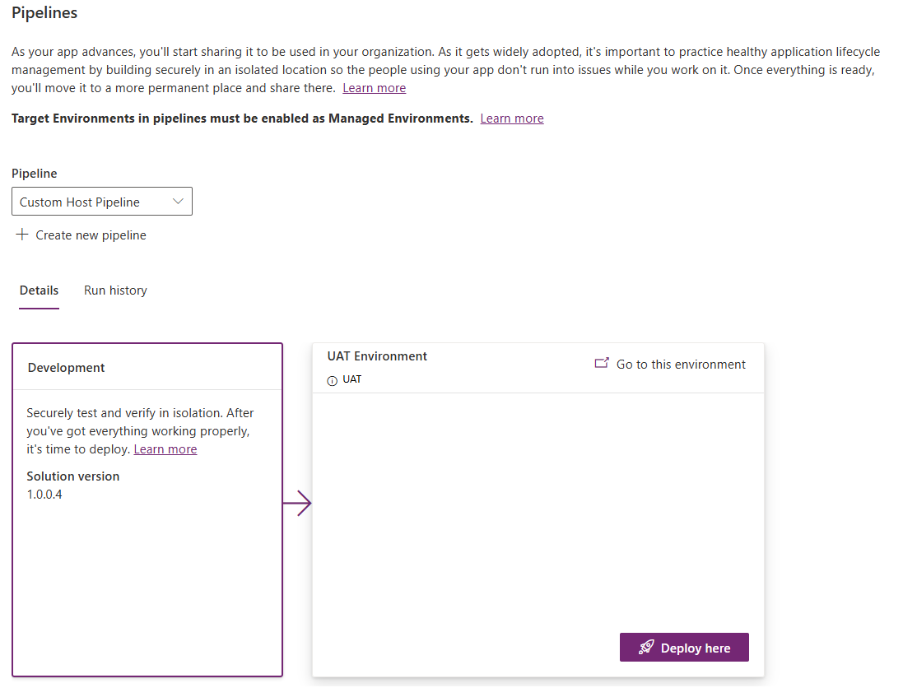

1. **Add client secret**
   - Next, let's add a certificate to our new app user. This is how we will authenticate our connection.
   - Click on **Certificated & secrets** in the navigation blade
   - Click **+ New client secret**
   - **Description**: add a descriptive note
   - **Expires**: Recommended: 180 days (6 months)
   - **IMPORTANT**: note the client secret value before navigating away and store it in an easily accessible place. Tip—use Notepad, stickynotes, or OneNote for easy copy/pate later
   - **Value**:

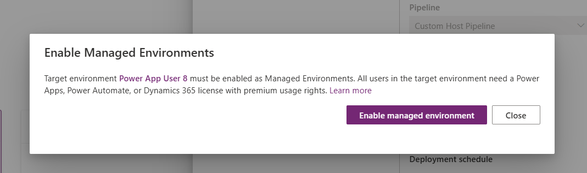

1. **Note application IDs**
   - Click on the **Overview** tab in the navigation blade
   - Note down **Application (client) ID** and **Directory (tenant) ID**
   - **Application (client) ID**:
   - **Directory (tenant) ID**:


### Step 2: Create Sharing Security Group

While we are still on the Azure portal, let's create our security group.

1. **Navigate to new group creation page**
   - Navigate to the new group creation page by using this link: https://portal.azure.com/?l=en.en-ie#view/Microsoft_AAD_IAM/AddGroupBlade

1. **Configure group details**
   - Use the following group details:
     - **Group Type**: Security
     - **Group Name**: Production App Access Group
   - Click **No members selected** to add members to the group
   - Search for your own lab user, click **Select**

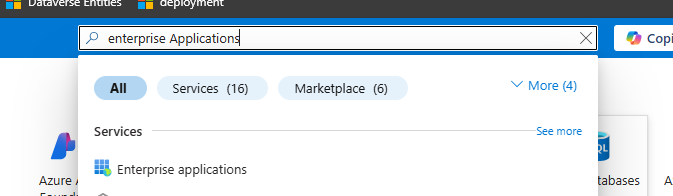


1. **Create the group**
   - Your group should look like this before clicking Create:

### Step 3: Create application user in Dataverse

Add Application User to each environment of our pipeline, including the Custom Host Environment

1. **Navigate to PPAC**
   - Navigate to PPAC at admin.powerplatform.microsoft.com
   - In the Environments tab, select your **Custom Host environment**

1. **Add new app user**
   - In the Access section, under **S2S apps**, click **See all**
   - Click **+ New app user**
   - **App**: click **+ Add an app** > select the app registration you created in step 1 (you may need to search the name of the App Registration if it is not listed) > click **Add**
   - **Business unit**: select default BU (type "org" and select the first item)
   - **Security roles**: System Administrator

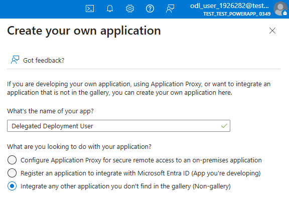

1. **Complete creation**
   - Click **Create**
   - Your application user will be listed with a # prefix in the Name column

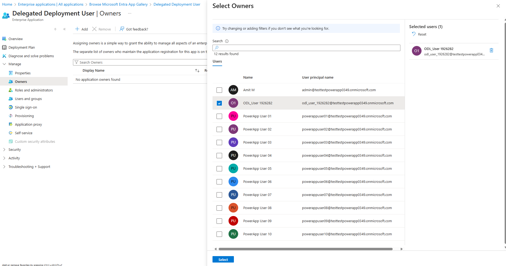

1. **Repeat for other environments**
   - Repeat step 3 for each of your Dev and Target environments

### Step 4: Create an approval + SPN delegated deployment flow

**Pathway 1**-- For the purposes of this lab, we have provided a complete version of this flow in your lab materials folder. If you are running low on time but would still like to complete this section of the lab, import the "Lab 3.zip" solution folder in your Custom Host Environment. After import, jump to Update Flow after solution import section.

**Pathway 2** -- If you would like to create the flow manually, follow the steps below.

> **NOTE**: In the instructions below, we have provided the written expression for the dynamic values. You may choose to copy/paste the expressions from the instructions below, or use the lightning bolt icon to add the dynamic values to your flow manually.

1. **Navigate to maker portal and create flow**
   - Navigate back to https://make.preview.powerapps.com/ and select your Custom Host Environment from the environment picker dropdown
   - Click **Flows** from the left-hand navigation blade
   - Click **+ New flow** > choose "Automated flow" and name your flow "SPN Delegated Deployment Approvals"

1. **Configure trigger**
   - Select the trigger "When an action is performed" from the Dataverse connector

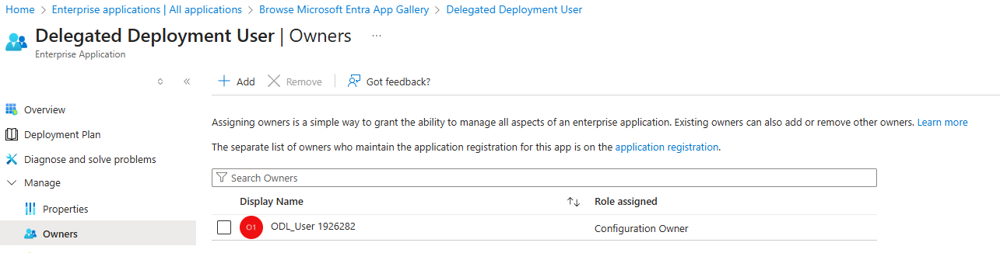

   - Configure the trigger with the following parameters:
     - **Catalog**: Microsoft Dataverse Common
     - **Category**: Power Platform Pipelines
     - **Table Name**: (none)
     - **Action Name**: OnApprovalStarted


1. **Set trigger condition (optional)**
   - Click the three dots and select **Settings**, set the trigger condition to the below parameter. This trigger condition allows us to have a unique flow process for each pipeline. If you'd like to use the same flow for all your pipelines, skip this step: `@equals(triggerOutputs()?['body/OutputParameters/DeploymentPipelineName'], '<<NAME YOU PROVIDED IN STEP 15.a IN THE PREVIOUS SECTION>>')`


1. **Add approval step**
   - Click **+New Step** and search for "Start and wait for an approval" in the Standard Approvals connector


   - Configure the approval with the following parameters (you may copy/paste the parameters):
     - **Approval Type**: Approve/Reject – First to respond
     - **Title**: `Deployment to @{triggerOutputs()?['body/OutputParameters/DeploymentStageName']} requires approval`
     - **Assigned To**: <<YOUR EMAIL HERE>>
     - **Details**: Provide the deployment details using the provided markdown format. A sample is provided below:

```markdown
1. **Requested by:** @{triggerOutputs()?['body/OutputParameters/DeployAsUser']}
1. **Pipeline:** @{triggerOutputs()?['body/OutputParameters/DeploymentPipelineName']}
1. **Target environment:** @{triggerOutputs()?['body/OutputParameters/DeploymentStageName']}
1. **Artifact name:** @{triggerOutputs()?['body/OutputParameters/ArtifactName']}
1. **Artifact version:** @{triggerOutputs()?['body/OutputParameters/SolutionArtifactVersion']}
1. **Scheduled time:** @{triggerOutputs()?['body/OutputParameters/ScheduledTime']}
1. **Download Artifact** @{triggerOutputs()?['body/OutputParameters/UnmanagedArtifactFileDownloadLink']}
1. **Deployment notes:** @{triggerOutputs()?['body/OutputParameters/AIGeneratedSolutionDescription']}
```

   - **Item Link**: `@{triggerOutputs()?['body/OutputParameters/StageRunDetailsLink']}`
   - **Item Link Description**: Stage Link
   - Click **Save**

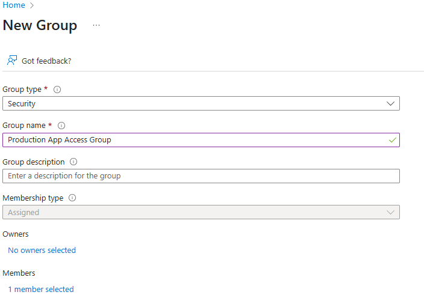

1. **Add condition**
   - Click **+ New step** and add a condition to check and add "responses approver response" dynamic variable to the condition. This is the expression parameter: "if `@items('Apply_to_each')?['approverResponse']` is equal to Approve. When you add the Condition parameter, an Apply to each will automatically be added around your condition


1. **Configure true condition**
   - In the **If yes** path, add the **Perform an unbound action** step from the Microsoft Dataverse connector
   - Configure the true condition with the following parameters:
     - **Action Name**: UpdateApprovalStatus
     - **StageRunId**: `@triggerOutputs()?['body/InputParameters/StageRunId']`
     - **ApprovalProperties**: `@{workflow()}`
     - **ApprovalStatus**: 20
   - **Tip**: Approval Status Step mappings: Pending- 10, Completed – 20, Failed – 30


1. **Configure false condition**
   - If the **If no** path, add the **Perform an unbound action** step from the Microsoft Dataverse connector
   - Configure the false condition with the following parameters:
     - **Action Name**: UpdateApprovalStatus
     - **StageRunId**: `@triggerOutputs()?['body/InputParameters/StageRunId']`
     - **ApprovalProperties**: `@{workflow()}`
     - **ApprovalStatus**: 30
   - **Tip**: Approval Status Step mappings: Pending- 10, Completed – 20, Failed – 30


1. **Save your flow**
   - Save your flow

1. **Configure SPN connection for true condition**
   - We're not done yet! Since we will be doing a delegated deployment, we need to configure the flow to use the SPN credentials to execute the approval action using the SPN's connection
   - On the **If yes** Dataverse action, click the 3 dots, click **+ Add new connection [Connection Reference]**


   - Configure the connection:
     - **Authentication Type**: Service Principal
     - **Client ID**: <Client ID of the App User you created earlier>
     - **Client Secret**: <Client secret of the App User certificate you created earlier>
     - **Tenant**: <TenantID you saved earlier>


1. **Configure SPN connection for false condition**
   - Do the same for the **If no** Dataverse action
   - Click **Save**

### Step 5: Update Flow after solution import

This section is only needed if you used the solution import method to create your flow. If you created the flow yourself, skip this section and continue on to the "Update pipeline to run as delegated" section.

After importing your solution, check the following items. If you need help with the steps, refer to the manual flow creation steps above.

1. **Ensure the Trigger Condition of your flow has the correct Pipeline name**
   - The sample pipeline is configured for "Custom Host Pipeline" Update only if you used a different name for your pipeline. Here is a sample trigger condition:
   - `@equals(triggerOutputs()?['body/OutputParameters/DeploymentPipelineName'], 'Custom Host Pipeline')`

1. **Update the If yes and If no connections to use the SPN connection**
   - Refer to step 16 and 17 above, if needed

### Step 6: Update pipeline to run as delegated

The flow we just created in the previous section will not trigger until we enable the Is Delegated Deployment gated extension in the pipeline configuration. Now, let's configure our pipeline to initiate the flow.

1. **Open Deployment Pipeline Configuration app**
   - Return to the Pipeline Host environment, and launch the **Deployment Pipeline Configuration** app
   - Click on the **Pipelines** tab
   - Open the pipeline you created earlier by clicking on the name you provided in step 15.a

1. **Configure deployment stage**
   - In the **Deployment Stages (Deployment pipeline)** grid, open the first stage in your pipeline. This will be the stage with a blank value in the Previous Deployment Stage column
   - On the deployment stage record form, check the box next to **Is Delegated Deployment**
   - Select **Service Principal** for Delegated Deployment Type
   - For **SPN Client Id**, provide the client ID of the app user you created earlier
   - **Allow sharing requests**: Yes


1. **Save changes**
   - Click **Save & Close**

### Step 7: Create a security role

Let's update our Contoso Real Estate solution with an additional component. We will create a security role to include as a part of the solution in our next deployment. We will also use this security role to grant access to users in the target environment after deployment is complete.

1. **Open solution**
   - In the developer environment, click on the **Solutions** tab, then drill into the Contoso Real Estate solution

1. **Create new security role**
   - Click **Objects** > **+New** > then **Security** > and finally, **Security Role**


1. **Configure security role**
   - Configure the Create New Role screen with these details:
     - **Role Name**: Contoso Real Estate Security Role
     - **Business Unit**: <root BU, usually begins with "org" prefix>
     - **Member's privilege inheritance**: Direct User (Basic) access level and Team privileges
     - Check the box for **Include App Opener privileges for running Model Driven Apps**
   - Click **Save**

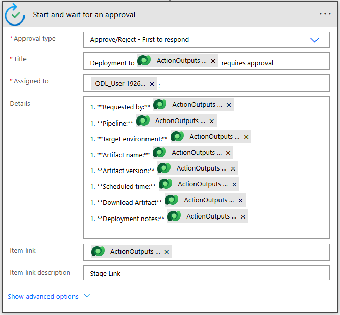

1. **Configure Listing table permissions**
   - Search "Listing" on the top right corner to filter Listing tables
   - Select **Listing** table, then click **Permission Settings**


   - Select **Collaborate** in the Permission Settings blade and click **Save**


1. **Configure Listing Image table permissions**
   - Repeat steps 4-6 for the **Listing Image** table as well

### Step 8: Share MDA with Security Role

Now, let's bind the Model Driven app with the new Security Role. This will allow us to set up sharing prior to deployment to the target env.

1. **Open Model Driven App**
   - In the Solution explorer, select the **Contoso Real Estate Listings** Model Driven App
   - Click **Share** in the ribbon


1. **Configure sharing**
   - In the Share Contoso Real Estate wizard, select the **App**
   - In the Dataverse connector dropdown, select **Contoso Real Estate Security Role**


1. **Complete sharing**
   - Click **Share**

### Step 9: Run SPN delegated pipeline

Finally, let's test the new approvals and SPN delegation steps we just added. Go to your development environment, where you just created the security role, and start a deployment using the Custom Host Pipeline. After the usual validation, you will see an additional step called Share which we didn't see when deploying before. This step will allow us to share objects within the Target environment directly from your Pipeline deployment. While the Contoso Real Estate solution doesn't have any connection references or environment variables, if the solution contains either of these components, you'd see additional steps called "Connections" and "environment variables" respectively.

After the Select deployment target step, we see the Share step:


1. **Configure sharing**
   - Search for **Production App Access** in the enter a group name box
   - Select the **Contoso Real Estate Security Role** to assign this role to members of the Production App Access team
   - Click **Next**, then click **Deploy** on the next page. The Deployment stage will look like this as the pipeline waits for the approval process to complete:


1. **Approve deployment**
   - For the purpose of this lab, we will use the Power Automate portal to grant the approval. Normally, you have the option to pick from Teams, Outlook, or Power Automate portal to review the approval request
   - Navigate to https://make.powerautomate.com/
   - Click on **Approvals** tab on the left navigation blade
   - You should see a pending approval here

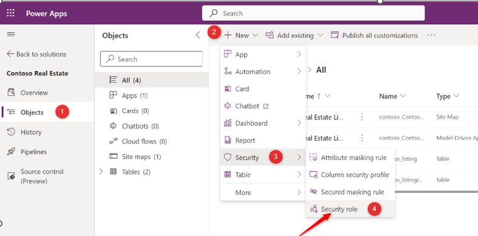

   - Click on the approval to review the request. An approval review wizard will appear on the right hand side of the screen. Choose **Approve** here:


1. **Monitor deployment**
   - Check back on your pipeline after receiving the approval. Your deployment stage will update with "Currently deploying version #.#.#.#"


1. **Verify sharing**
   - Once complete, click on the **Go to this environment** hyperlink on the deployment stage
   - Click on the **Solutions** blade on the left-hand navigation
   - Click **Managed** tab
   - Open the **Contoso Real Estate** solution > On the Model Driven App, select **3 dots** > click **Share**
   - On the Share Pane, scroll down and verify that the **Production App Access Group** is listed

---

## ⏮️ Task 4: Redeploy a prior version

**Prerequisite**: If you didn't complete task 4, submit another deployment now. Run History should have at least two deployed versions.

While delegated deployments and approvals reduce the chances of breaking applications in production, mistakes can and do happen.

Let's pretend the last deployment contained a critical breaking change and it needs to be rolled back. In this task, you'll re-deploy the last known good version of your solution.

### Step 1: Access Run History and redeploy

1. **Open maker portal**
   - Open the maker portal (https://make.preview.powerapps.com/) and make sure you are in your development environment

1. **Navigate to solution**
   - Open **Solutions** from the left hand navigation blade
   - Open the unmanaged solution (Contoso Real Estate) that you deployed using the pipeline earlier in this lab

1. **Access Run History**
   - Select **Pipelines** > click on the **Run History** tab


1. **Initiate redeploy**
   - Select the lower version, then **Re-deploy** from the menu

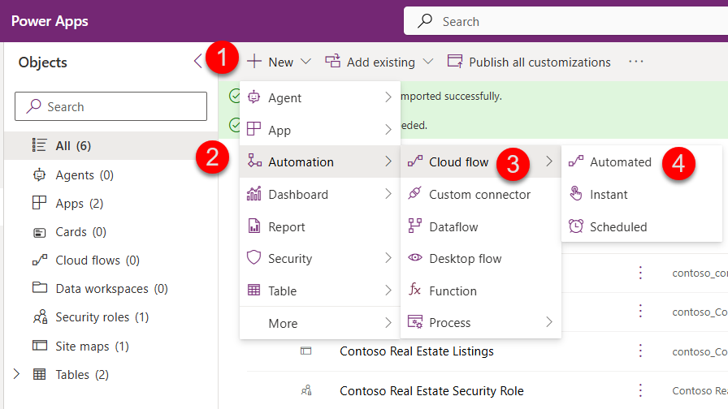

1. **Confirm redeploy**
   - Select **Redeploy** in the confirmation popup

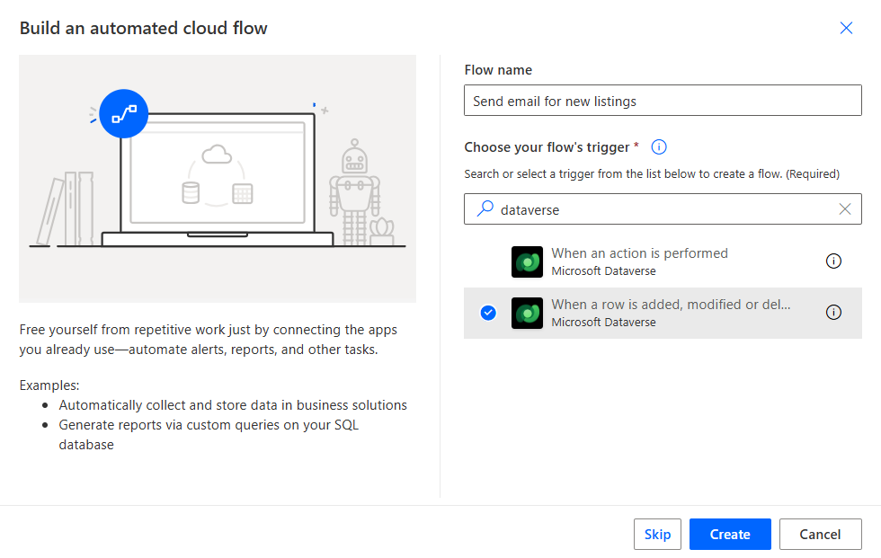

1. **Complete deployment**
   - When the deployment panel opens, click **Next** until you get to the last screen, then **Deploy**. See prior Task for detailed steps if needed

1. **Approve deployment**
   - In a new tab, open Power Automate portal again and Approve the deployment request

1. **Monitor completion**
   - Deployment is now in-progress. Wait until it finishes. You may need to refresh the pipelines page

> **Disaster averted!** Now the prior version is deployed to production and you have time to fix the (hypothetical) issue and deploy an updated version when ready.

---

## 📎 Appendix

### Steps to enable Managed Environments

1. **Navigate to Power Platform Admin Center**
   - Navigate to Power Platform Admin Center (PPAC) at https://admin.powerplatform.microsoft.com/manage/environments
   - In the Manage tab on the left hand side, click on **Environments**

1. **Select environment**
   - Select the environment where you want to enable Managed Environments

1. **Enable Managed Environments**
   - In the ribbon, click **Enable Managed Environments**
   - Click **Enable** in the fly out wizard


1. **Repeat for other environments**
   - Repeat steps 3-5 for any other environments where you need to enable Managed Environments
