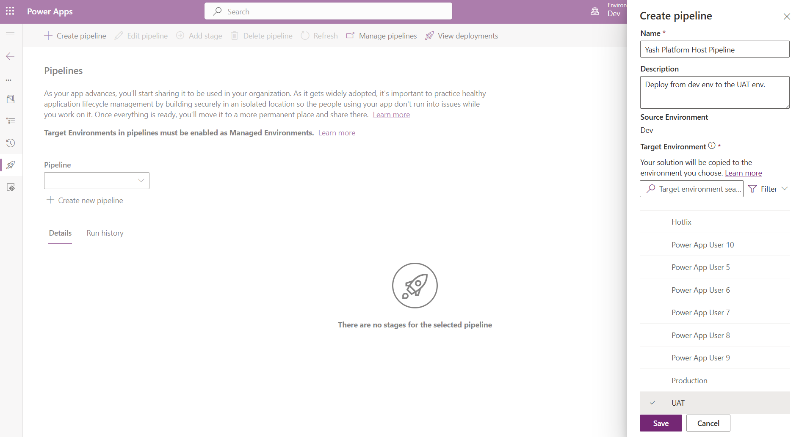
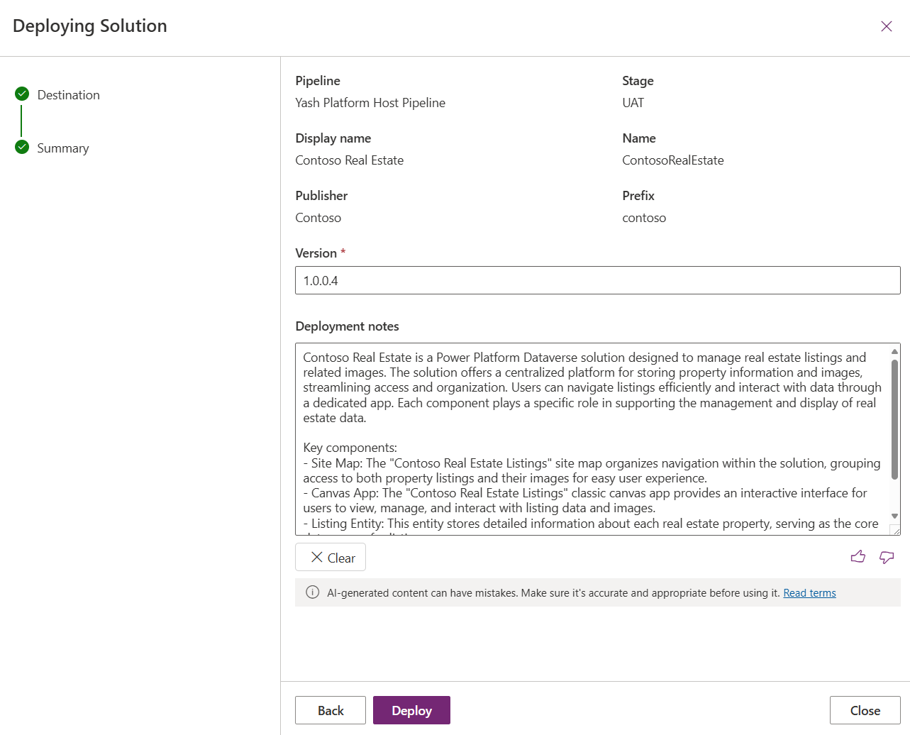
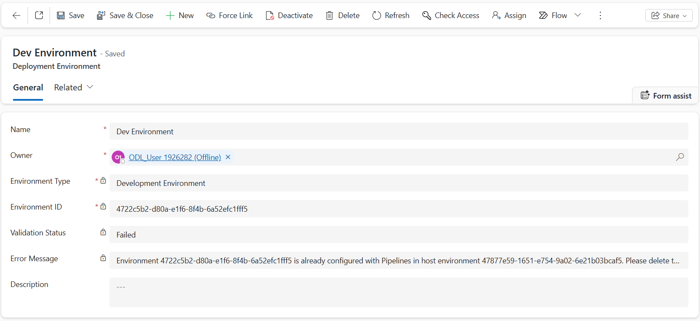
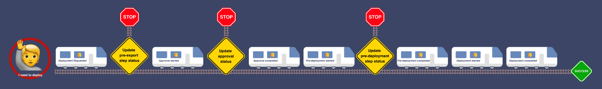
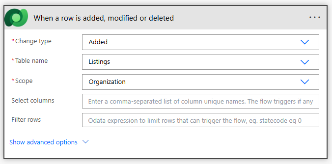
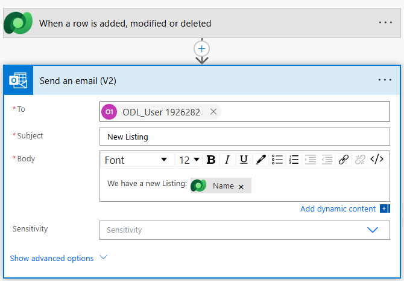
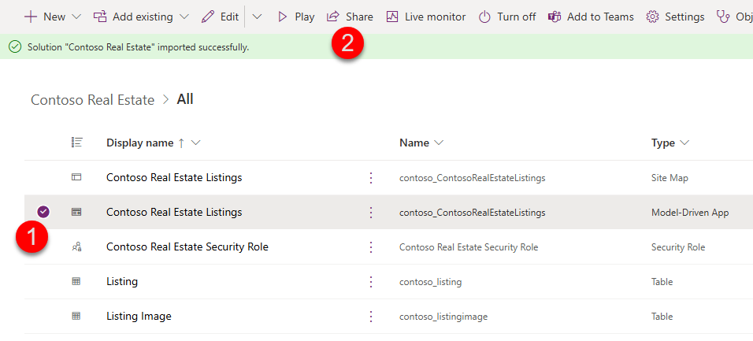
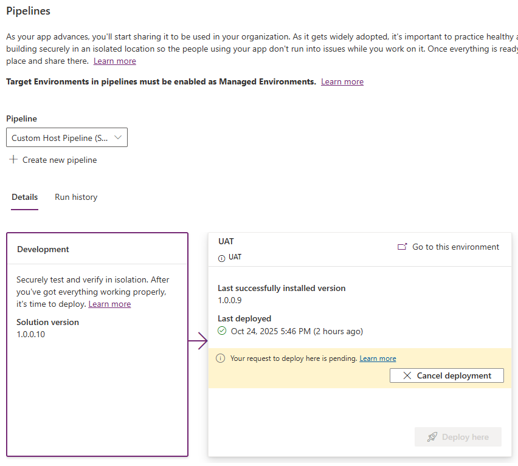
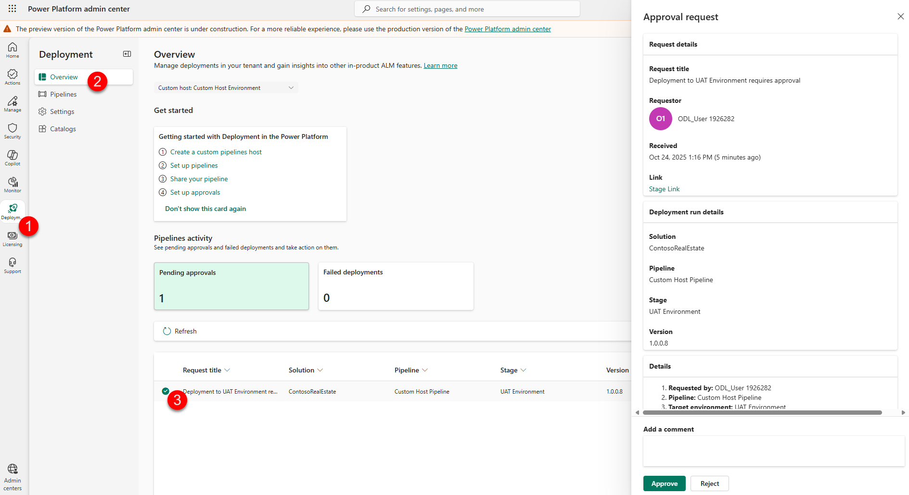

# 🚀 Lab 3: Deploy

A key facet of healthy ALM is separating changes in development from those in testing and in production. Pipelines in Power Platform deploys the latest version of your solution across these environments, with the ability to add secure approvals and review changes before they're deployed. Note: in this lab you'll only deploy from development to production, but in the real world it's recommended to add an additional test stage. Other stages may also be added.

✅ Lab tasks

In this lab, you will go through the following tasks:

1. [Create a Platform Host pipeline](#-task-1---create-a-platform-host-personal-pipeline)
1. [Create a Custom Host pipeline](#️-task-2---create-a-custom-host-pipeline)
1. [Extend pipelines (optional, but highly recommended)](#-task-3-optional---extend-pipelines)
1. [Redeploy a prior version](#-task-4---redeploy-a-prior-version)

---

## 📋 Prerequisites

Complete lab 2.1

If you did not complete lab 2.1, import the [ContosoRealEstate_1_0_0_2.zip](assets/ContosoRealEstate_1_0_0_2.zip) unmanaged solution in your development environment. This solution is available in your lab materials folder.

---

## 📚 Types of Pipelines

There are two ways to configure Power Pipelines:

**Platform host** - Out of the box tenant-wide pipelines ghosted under a "platform host" configuration. These pipelines are configured by makers for personal use. Personal pipelines cannot be extended, nor can they be shared with other makers in the tenant.

**Custom host** - Pipelines configuration hosted under a custom environment, where Power Pipelines modules are installed by admins. Custom pipelines enable greater control as they are centrally governed by admins and shared with makers for use. Custom host pipelines also provide greater visibility, like audit where a certain solution is deployed and who initiated the request. Custom host pipelines also retain backups of solution artifacts in both Managed and Unmanaged forms. Due to these reasons, custom hosts draw from your Dataverse storage capacity whereas the platform host doesn't.

---

## 🎯 Task 1 - Create a Platform Host Personal Pipeline

### Step 1: Navigate to Power Apps and create a pipeline

1. **Navigate to your Dev environment**
   - On the Maker Portal (https://make.preview.powerapps.com), make sure the Dev env is selected on the top right environment drop down

1. **Access the Solutions area**
   - Click on **Solutions** tab in the left-hand navigation blade

1. **Open your solution**
   - Once in the Solutions page, open the **Contoso Real Estate** solution

1. **Open the Pipelines page**
   - On the left-hand navigation panel, click on the rocket icon for Power Pipelines page



1. **Create a new pipeline**
   - On the Pipelines page, select **+ Create pipeline**

1. **Configure the pipeline**
   - In the Create pipeline pop out wizard, provide the following details:
     - **Name**: <Your Name> Platform Host Pipeline
     - **Description**: Include description of which environments this pipeline will deploy to
     - **Target environment**: select your UAT environment
   - Click **Save**


The completed pipeline should now have two stages—Development and UAT.



You're now ready to use this Pipeline to deploy your solutions! In the real world, if your specific deployment process requires an additional environment, click on Add Stage button to add additional stages.

### Step 2: Deploy using a Platform Host pipeline

Now, let's do a quick deployment to the UAT env to test our pipeline.

1. **Initiate deployment**
   - On the UAT stage, click **Deploy here** to initiate the solution deployment to production


1. **Schedule deployment (optional)**
   - You can schedule deployments by selecting **Later** in the Deployment Schedule section to set a time and date for your scheduled deployment
   - Click **Next**


1. **Review and deploy**
   - In the summary section, review the AI-generated note in the Deployment Notes section. It contains a summary of your solution's capabilities
   - Click **Deploy** to begin your deployment


1. **Monitor deployment progress**
   - Your UAT stage will update with the progress of the deployment:


1. **Verify deployment completion**
   - When the deployment completes, you can see the success message on the stage:


> **Remember**: Platform Host pipelines are not shareable, nor can they be extended to support approvals or delegations. Continue to the Custom Host Pipelines section to create extendable and shareable pipelines.

---

## 🏗️ Task 2 - Create a Custom Host Pipeline

### Step 1: Create a Custom Host environment

Let's begin by creating a new Custom Host Environment. This special-purpose environment acts as the storage and management plane for all pipeline configuration, security, and run history. You can install multiple Custom Host environments to separately manage pipelines for different business orgs or geographic locations. One host for the entire tenant is also acceptable as long as all environments are in the same geographic location.

1. **Access Power Platform Admin Center**
   - In the Power Platform Admin Center (https://admin.preview.powerplatform.microsoft.com/) select **Deployments** from the left-hand navigation panel
   - Make sure you are on the **Overview** tab


1. **Create new custom host**
   - Click **+ New custom host** button to kick off a new environment creation with Power Platform Pipelines modules pre-installed


1. **Configure the New Environment creation**
   - **Name**: "Custom Host Environment"
   - **Make this a Managed Environment**: Yes
   - **Region**: Canada
   - **Get new features early**: Yes
   - **Type**: Developer
   - Click **Next**



1. **Configure Security Group (Optional)**
   - Under **Security Group**, click **+ Select**, select **None**
   - Note: In a real-world setting, using a Security Group is recommended to allow only authorized users access to this environment
   - Click **Save**


Now that the Custom Host Environment is created, we can begin configuring the custom host pipeline.

We will be using the same Dev and UAT environments for the Custom Host pipeline we build in this lab. Make sure you have the EnvironmentIds for both environments handy.

| Original Environment Name | New Environment Name | EnvironmentId | Purpose |
|---|---|---|---|
| Power App User 1 | Dev | | Development |
| Power App User 2 | Hotfix | | Secondary environment for hotfix development and multi-environment testing |
| Power App User 3 | UAT | | Testing your solution |
| Power App User 4 | Production | | Where your solutions are shared with end users |

### Step 2: Configure environment records for the pipeline

1. **Navigate back to PowerApps maker portal**
   - Navigate back to PowerApps maker portal at https://make.preview.powerapps.com/
   - In the top right hand corner in the Environment selection dropdown, select the **Custom Host Environment** which you just created

1. **Open Deployment Pipeline Configuration app**
   - Click on the **Apps** tab
   - Click on the play icon on the **Deployment Pipeline Configuration** app to play it


1. **Access Environments section**
   - In the Pipeline Configuration app, select **Environments** on the left pane, then **+ New**


1. **Create development (source) environment record**
   - Let's create the development (source) environment record. We will use the Dev environment for this. Select **New** in the ribbon to create a new environment record
   - **Name**: Dev Environment
   - **Environment Type**: Select **Development Environment** for your source environment
   - **Environment Id**: <Environment ID of the Dev env>
   - Click **Save**


1. **Validate the environment**
   - Wait for one minute, and click **refresh** in the ribbon to check the **Validation Status**
   - Since we already used this Dev environment in our Platform Host Pipeline, the validation will fail


1. **Force Link the environment**
   - Let's use the **Force Link** button in the ribbon to bypass this error. Click **Force Link** in the ribbon, then click **Confirm** in the dialog box


1. **Verify validation status**
   - Wait a minute, then refresh to verify **Validation Status** equals **Success**


1. **Create UAT (target) environment record**
   - Let's create the UAT (target) environment record. Select **New** in the ribbon to create a new environment record
   - **Name**: UAT Environment
   - **Environment Type**: Target Environment
   - **Environment Id**: <Environment ID of the UAT env>
   - Click **Save**


1. **Validate UAT environment**
   - If Validation fails, repeat the steps to **Force Link** this environment to the Custom Host Pipeline
   - Once complete, verify **Validation Status** equals **Success**


1. **Add additional target environments (if needed)**
   - Repeat step 7 again if you want to add more than one target environment

### Step 3: Configure a basic pipeline

1. **Access Pipelines section**
   - Select **Pipelines** in the left navigation pane



1. **Create new deployment pipeline**
   - Select **New** in the ribbon to create a new deployment pipeline record
   - **Name**: Custom Host Pipeline
   - **Description**: optional, add a description of the purpose this pipeline serves
   - **AI deployment notes**: Enabled
   - **Allow redeployments of older versions**: Enabled
   - **Deployment Type**: Standard
   - Click **Save**


1. **Link development environment**
   - Scroll down to the **Linked Development Environments** grid
   - Click on the three vertical dots on the top right corner of the grid to open additional grid options
   - Select **Add Existing Deployment Environment**, then select **Dev environment** you configured earlier in this lab, then click **Add**


1. **Create deployment stage**
   - In the **Deployment Stages (Deployment pipeline)** grid, select **New Deployment Stage**
   - Complete the form:
     - **Name**: UAT Environment
     - **Description**: optional, add a description of the environment you are deploying to
     - **Previous Deployment Stage**: Leave blank as this will be our first deployment stage
     - **Target Deployment Environment ID**: UAT Environment
   - Click **Save and Close**


1. **Add additional stages (if needed)**
   - In the real world, repeat last two steps if you have more than one target environments for your pipeline
   - This pattern can be repeated to add up to 7 deployment stages in your pipeline

> **Congratulations!** You have created a basic Custom Host Pipeline. Go to your development (source) environment, and open any unmanaged solution. Then, click on the Pipelines tab (rocket icon) to open the Pipelines pane. Here, you will see your newly created pipeline:


### Step 4: Deploy Using a Custom Host pipeline

1. **Initiate deployment**
   - Click **Deploy here** button in the UAT Environment stage


1. **Enable Managed Environment**
   - You will get a popup which asks you to enable Managed Environments (ME) on the target env. Remember, Pipelines are a ME only feature. Your Target environments must be enabled for ME to perform a deployment. Only Power Platform and D365 Admins will see this prompt, so in the real world, admins should enable ME on every environment they expect to be used in a pipeline. Steps to enable ME can be found here. Click **Enable managed environment**


1. **Complete the deployment**
   - Follow the same steps you performed in the Deploy Using a Platform Host pipeline section to complete the deployment

So far, the two types of pipelines we've explored enable basic deployments only. However, some processes call for greater control over the deployment process to ensure production assets are kept safe from unintentional or unapproved changes. For example, while administrators have permission to deploy to production, it's important makers and developers do not have elevated access. Or, maybe the process mandates an admin or change manager's approval before a deployment to production can be initiated. Let's configure our pipeline to support these processes.

---

## 🔧 Task 3 (Optional) - Extend Pipelines

### Gated extensions

In this section, we will extend deployment pipelines we created in the sections above. Extending pipelines allows organizations to tailor pipelines to their unique needs. For example, you can add approvals, deploy via service principals, and integrate with internal systems of record, Azure DevOps, GitHub, and much more. Custom steps can be initiated at various stages of the pipeline. These steps are defined by Microsoft Dataverse business events. In Power Pipelines terminology, these initiation stages are called "Gated Extensions." Here are the 3 available gated extensions:

**Pre-export step required**: Allows running custom validation logic when a deployment request is submitted. Pipelines won't export the solution from a development environment until this step is marked as completed. This should only be used on the first stage of the pipeline.

**Pre-deployment step required**: Allows initiation of custom steps after a deployment has been triggered, but before installation begins on the target environment. This gated extension can be used to trigger processes such as approvals before a solution is deployed to the target environment.

**Is delegated deployment**: Carries out deployments using a service principal or pipeline stage owner's identity instead of the requesting maker's identity. This identity ensures makers can request deployments without elevated (or any) access within target environments. Requires approval from an authorized identity.

Each step of a pipeline deployment triggers a real-time event at the beginning and completion of the step for which you can initiate custom logic. Additional triggers are produced when gated extensions are enabled. These correspond to the custom step inserted when an extension is enabled on the pipeline stage.

The tables here indicate triggers and actions required for each extension:

| Gated extension | Start trigger | Complete Step | Unbound action | Connection to use |
|---|---|---|---|---|
| Pre-export step required | OnDeploymentRequested | N/A | UpdatePreExportStepStatus | Any identity with access to update the deployment stage run record |
| Is delegated deployment | OnApprovalStarted | OnDeploymentCompleted | N/A | Create a connection as the service principal or pipeline stage owner as configured on the pipeline stage. The pipeline stage owner must be an owner of the service principal in Microsoft Entra ID. |
| Predeployment step required | OnPreDeploymentStarted | OnPreDeploymentCompleted | UpdatePreDeploymentStepStatus | Any identity with access to update the deployment stage run record |

Now, let's extend the Custom Host pipeline we created in the previous task to include an Approval step. Once we get the approval, we will perform a Delegated deployment using a SPN user.

### Step 1: Create Application User

1. **Navigate to Azure Portal**
   - Navigate to https://portal.azure.com
   - You'll need to set up MFA to proceed with the Enterprise Application creation. This is a security requirement for accessing the Azure portal. Follow the on screen instructions to configure MFA

1. **Create Enterprise Application**
   - Once you have access to the Azure portal, search "Enterprise Applications" in the top search bar


1. **Create new application**
   - In the Enterprise applications page, click **+ New Application**, then select **+ Create your own application**


1. **Configure application**
   - In the Create your own application wizard, provide a name for your enterprise application. We will use "Delegated Deployment User." Click **Create**


1. **Add owners**
   - Once your Enterprise application is created, in the left hand navigation pane, click **Owners** under the Manage tab
   - Click **+ Add** to add your own user as an owner. You can find your own username by clicking your username on the top right corner. It will most likely begin with "ODL_User…" Click **Select**


> **Note**: This owner you added to this application user must correspond to the Stage Owner where you initiate the gated extension from. We will need to remember this for later in this lab.

1. **Access Application registration**
   - Under the Security tab, select **Permissions**, then click the **Application registration** link


1. **Add client secret**
   - Next, let's add a certificate to our new app user. This is how we will authenticate our connection
   - Under the Manage tab, click on **Certificates & secrets**
   - Click **+ New client secret**
   - **Description**: Delegated Deployment
   - **Expires**: Recommended: 180 days (6 months)
   - **IMPORTANT**: note the client secret value before navigating away and store it in an easily accessible place. Tip—use Notepad, sticky notes, or OneNote for easy copy/paste later
   - **Value**:


1. **Note application IDs**
   - Click on the **Overview** tab in the navigation blade
   - Note down **Application (client) ID** and **Directory (tenant) ID**
   - **Application (client) ID**:
   - **Directory (tenant) ID**:


### Step 2: Create Sharing Security Group

While we are still on the Azure portal, let's create our security group.

1. **Navigate to new group creation page**
   - Navigate to the new group creation page by using this link: https://portal.azure.com/?l=en.en-ie#view/Microsoft_AAD_IAM/AddGroupBlade

1. **Configure group**
   - Use the following group details:
     - **Group Type**: Security
     - **Group Name**: Production App Access Group
   - Click **No members selected** to add members to the group
   - Search for your own lab user, click **Select**


Your group should look like this before clicking Create:


### Step 3: Create application user in Dataverse

Add Application User to each environment of our pipeline, including the Custom Host Environment

1. **Navigate to PPAC**
   - Navigate to PPAC at admin.powerplatform.microsoft.com
   - In the Environments tab, select your **Custom Host environment**

1. **Access S2S apps**
   - In the Access section, under **S2S apps**, click **See all**


1. **Create new app user**
   - Click **+ New app user**
   - **App**: click **+ Add an app** > select the app registration you created in step 1 (you may need to search the name of the App Registration if it is not listed) > click **Add**
   - **Business unit**: select default BU (type "org" and select the first item)
   - **Security roles**: System Administrator*
   - *The System Administrator role is required for the SPN user as it is necessary to deploy certain solutions containing components, such as plugins
   - Click **Create**


Your application user will be listed with a # prefix in the Name column


1. **Repeat for other environments**
   - Repeat this process for your **Dev** and **UAT** environments

### Step 4: Create an approval + SPN delegated deployment flow

**Pathway 1** - For the purposes of this lab, we have provided a complete version of this flow in your lab materials folder. If you are running low on time but would still like to complete this section of the lab, manually import the "[Lab 3 Approval Delegation Flow.zip](assets/Lab3ApprovalDelegationFlow_1_0_0_1.zip)" solution folder in your Custom Host Environment. After import, jump to **Update Flow after solution import** section.

**Pathway 2** - If you would like to create the flow manually, follow the steps below.

> **NOTE**: In the instructions below, we have provided the written expression for the dynamic values. You may choose to copy/paste the expressions from the instructions below, or use the lightning bolt icon to add the dynamic values to your flow manually.

1. **Navigate to maker portal**
   - Navigate back to https://make.preview.powerapps.com/ and select your **Custom Host Environment** from the environment picker dropdown

1. **Create new flow**
   - Click **Flows** from the left-hand navigation blade
   - Click **+ New flow** > choose "Automated cloud flow" and name your flow "SPN Delegated Deployment Approvals"


1. **Configure trigger**
   - Select the trigger "When an action is performed" from the Dataverse connector
   - Configure the trigger with the following parameters:
     - **Catalog**: Microsoft Dataverse Common
     - **Category**: Power Platform Pipelines
     - **Table Name**: (none)
     - **Action Name**: OnApprovalStarted


1. **Set trigger condition**
   - Click the three dots and select **Settings**, set the trigger condition to the below parameter. This trigger condition allows us to have a unique flow process for each pipeline. If you'd like to use the same flow for all your pipelines, skip this step:
   - `@equals(triggerOutputs()?['body/OutputParameters/DeploymentPipelineName'], 'Custom Host Pipeline')`


1. **Add connection reference**
   - On the trigger "When an action is performed" Dataverse action, click the 3 dots, click **+ Add new connection [Connection Reference]**
   - Configure the connection:
     - **Authentication Type**: Service Principal
     - **Client ID**: <Client ID of the App User you created earlier>
     - **Client Secret**: <Client secret of the App User certificate you created earlier>
     - **Tenant**: <TenantID you saved earlier>


1. **Add approval step**
   - Click **+ New Step** and search for "Start and wait for an approval" in the Standard Approvals connector
   - Configure the approval with the following parameters (you may copy/paste the parameters):
     - **Approval Type**: Approve/Reject – First to respond
     - **Title**: Deployment to @{triggerOutputs()?['body/OutputParameters/DeploymentStageName']} requires approval
     - **Assigned To**: <<YOUR EMAIL HERE>>
     - **Details**: Provide the deployment details using the provided markdown format. A sample is provided below:

```
1. **Requested by:** @{triggerOutputs()?['body/OutputParameters/DeployAsUser']}
1. **Pipeline:** @{triggerOutputs()?['body/OutputParameters/DeploymentPipelineName']}
1. **Target environment:** @{triggerOutputs()?['body/OutputParameters/DeploymentStageName']}
1. **Artifact name:** @{triggerOutputs()?['body/OutputParameters/ArtifactName']}
1. **Artifact version:** @{triggerOutputs()?['body/OutputParameters/SolutionArtifactVersion']}
1. **Scheduled time:** @{triggerOutputs()?['body/OutputParameters/ScheduledTime']}
1. **Download Artifact** @{triggerOutputs()?['body/OutputParameters/UnmanagedArtifactFileDownloadLink']}
1. **Deployment notes:** @{triggerOutputs()?['body/OutputParameters/AIGeneratedSolutionDescription']}
```

   - **Item Link**: @{triggerOutputs()?['body/OutputParameters/StageRunDetailsLink']}
   - **Item Link Description**: Stage Link


1. **Save flow**
   - Click **Save**

1. **Add condition**
   - Click **+ New step** and add a condition to check and add "responses approver response" dynamic variable to the condition. This is the expression parameter: `if @items('Apply_to_each')?['approverResponse'] is equal to Approve`. When you add the Condition parameter, an Apply to each will automatically be added around your condition


1. **Configure true condition**
   - In the **If yes** path, add the **Perform an unbound action** step from the Microsoft Dataverse connector
   - Configure the true condition with the following parameters:
     - **Action Name**: UpdateApprovalStatus
     - **ApprovalComments**: @{items('Apply_to_each')?['comments']}
     - **StageRunId**: @triggerOutputs()?['body/InputParameters/StageRunId']
     - **ApprovalProperties**: @{workflow()}
     - **ApprovalStatus**: 20
   - Tip: Approval Status Step mappings: Pending- 10, Completed – 20, Failed – 30


1. **Configure false condition**
   - If the **If no** path, add the **Perform an unbound action** step from the Microsoft Dataverse connector
   - Configure the false condition with the following parameters:
     - **Action Name**: UpdateApprovalStatus
     - **ApprovalComments**: @{items('Apply_to_each')?['comments']}
     - **StageRunId**: @triggerOutputs()?['body/InputParameters/StageRunId']
     - **ApprovalProperties**: @{workflow()}
     - **ApprovalStatus**: 30
   - Tip: Approval Status Step mappings: Pending- 10, Completed – 20, Failed – 30


1. **Save flow**
   - Save your flow

We're not done yet! Since we will be doing a delegated deployment, we need to make sure to configure the flow to use the SPN credentials to update the UpdateApprovalStatus actions.

1. **Update If yes connection**
   - On the **If yes** Dataverse action, click the 3 dots, check to see if the connection you created earlier is the one associated to this action. It should say "Microsoft Dataverse." If not, click **+ Add new connection [Connection Reference]**
   - Configure the connection:
     - **Authentication Type**: Service Principal
     - **Client ID**: <Client ID of the App User you created earlier>
     - **Client Secret**: <Client secret of the App User certificate you created earlier>
     - **Tenant**: <TenantID you saved earlier>


1. **Update If no connection**
   - Do the same for the **If no** Dataverse action

1. **Save flow**
   - Click **Save**

### Step 5: Update Flow after solution import

This section is only needed if you used the solution import method to create your flow. If you created the flow yourself, skip this section and continue on to the "Update pipeline to run as delegated" section.

After importing your solution, check the following items. If you need help with the steps, refer to the manual flow creation steps above.

1. **Check trigger condition**
   - Ensure the **Trigger Condition** of your flow has the correct Pipeline name. The sample pipeline is configured for "Custom Host Pipeline" Update only if you used a different name for your pipeline. Here is a sample trigger condition:
   - `@equals(triggerOutputs()?['body/OutputParameters/DeploymentPipelineName'], 'Custom Host Pipeline')`


1. **Update assigned to**
   - In the **Start and wait** action, update the **Assigned to** field with your username

1. **Update trigger connection**
   - Update the trigger with the SPN connection. Refer to steps 7 and 8

1. **Update If yes/no connections**
   - Update the **If yes** and **If no** connections to use the SPN connection. Refer to step 18 and 19 above, if needed

### Step 6: Update pipeline to run as delegated

The flow we just created in the previous section will not trigger until we enable the **Is Delegated Deployment** gated extension in the pipeline configuration. Now, let's configure our pipeline to initiate the flow.

1. **Open Pipeline Configuration app**
   - Return to the **Pipeline Host environment**, and launch the **Deployment Pipeline Configuration** app
   - Click on the **Pipelines** tab
   - Open the pipeline you created earlier called **Custom Host Pipeline**

1. **Configure delegated deployment**
   - In the **Deployment Stages (Deployment pipeline)** grid, open the first stage in your pipeline. This will be the stage with a blank value in the **Previous Deployment Stage** column
   - On the deployment stage record form, check the box next to **Is Delegated Deployment**
   - Select **Service Principal** for **Delegated Deployment Type**
   - For **SPN Client Id**, provide the client ID of the app user you created earlier
   - **Allow sharing requests**: Yes
   - Take note of the **stage Owner** field (highlighted in green on the screenshot below). It is important that the owner you added on the Enterprise Application we created earlier match the owner of this stage


1. **Save and close**
   - Click **Save & Close**

### Step 7: Create a security role

Let's update our Contoso Real Estate solution with an additional component. We will create a security role to include as a part of the solution in our next deployment. We will also use this security role to grant access to users in the target environment after deployment is complete.

1. **Navigate to solution**
   - In the developer environment, click on the **Solutions** tab, then drill into the **Contoso Real Estate** solution

1. **Create new security role**
   - Click **Objects** > **+ New** > then **Security** > and finally, **Security Role**



1. **Configure security role**
   - Configure the Create New Role screen with these details:
     - **Role Name**: Contoso Real Estate Security Role
     - **Business Unit**: <root BU, usually begins with "org" prefix>
     - **Member's privilege inheritance**: Direct User (Basic) access level and Team privileges
     - Check the box for **Include App Opener privileges for running Model Driven Apps**
   - Click **Save**



1. **Configure Listing permissions**
   - Search "Listing" on the top right corner to filter Listing tables
   - Select **Listing** table, then click **Permission Settings**
   - Select **Collaborate** in the Permission Settings blade and click **Save**


1. **Configure Listing Image permissions**
   - Repeat steps 4-6 for the **Listing Image** table as well

### Step 8: Create a Power Automate Cloud Flow

So far, we do not have any connection references in the app. For the purposes of demonstrating connections and connection sharing capabilities of pipelines, let's add a quick flow to our solution. Skip this step if you are running low on time! It is not required to perform a successful delegated deployment.

1. **Create new cloud flow**
   - In the Contoso Real Estate solution, click **+ New** > then **Automation** > **Cloud Flow** > **Automated**
   - **Name** your flow "Send email for new listings"
   - Search for **Dataverse**, and select **When a row is added, modified, or deleted** trigger
   - Click **Create**



1. **Configure trigger**
   - In the maker canvas, on the Trigger action select **Oauth Authentication Type** and complete the sign in wizard
   - In the Trigger action, complete the following:
     - **Change Type**: Added
     - **Table name**: Listings
     - **Scope**: Organization


1. **Add email action**
   - Click **+ New step**
   - Search for **Outlook** and select **Send an email (V2)** action
   - Configure the Send an email (V2) action like below:
     - **To**: <your own username>
     - **Subject**: New Listing
     - **Body**: We have a new listing: <Name dynamics value>


1. **Save flow**
   - Click **Save**

In your solution, you will now see 3 new items. In addition to the Cloud Flow, as we used two connections in the flow, one for Dataverse and another for Outlook, we will have 2 connection references added. Connection references are a means to package connection mappings to various actions in a solution.


### Step 9: Share MDA with Security Role

Now, let's bind the Model Driven app with the new Security Role. This will allow us to set up sharing prior to deployment to the target env.

1. **Share app**
   - In the Solution explorer, select the **Contoso Real Estate Listings** Model Driven App
   - Click **Share** in the ribbon (If the share button is not illuminated, uncheck and click Publish All Customizations first)


1. **Assign security role**
   - In the Share Contoso Real Estate wizard, select the App
   - In the **Dataverse** connector dropdown, select **Contoso Real Estate Security Role**
   - We are not sharing with any users yet, so go ahead and click **Share**



### Step 10: Run SPN delegated pipeline

Finally, let's test the new approvals and SPN delegation steps we just added. Go to your development environment, where you just created the security role, and start a deployment using the Custom Host Pipeline. After the usual validation, you will see an additional step called **Share** which we didn't see when deploying before. This step will allow us to share objects within the Target environment directly from your Pipeline deployment. Since we also added a cloud flow with two connections, we will also see a new **Connections** step when deploying.

1. **Deploy with connections**
   - After the **Select deployment target** step, we see the **Connections** step. Make sure you leave "Share connections with the service principal" checked as this is a requirement to associate new connections with the connection references in the UAT env



1. **Configure sharing**
   - After clicking Next, we see the **Share** step:
   - Search for **Production App Access** in the enter a group name box
   - Select the **Contoso Real Estate Security Role** to assign this role to members of the Production App Access team. Click **Next**


1. **Review and deploy**
   - On the summary tab, take a close look at the AI-generated Deployment Notes section. This will be provided for all approvers to review as a part of the approval request
   - Click **Deploy** on the next page. The Deployment stage will update as it waits for the approval process to complete

1. **Approve deployment**
   - Now, let's approve our deployment. While there are many ways to action on an Approval request in Power Platform, such as Approvals tab on Power Automate Maker portal, Approvals in Teams, or Approval email in Outlook, we will leverage new Advanced Approvals functionality in Deployments to approve the request. This is a great one-stop-shop like experience for Admins who are responsible for reviewing approvals across multiple pipelines under the same Host or across multiple Hosts
   - Navigate to the PPAC at https://admin.preview.powerplatform.microsoft.com/deployment/overview
   - On the **Overview** tab, you will see the **Pipelines activity** section
   - Here, you should find the approval you just initiated through your deployment pipeline. Click on it to see the deployment details of the Approval request
   - Provide comments for your request, and click **Approve**

1. **Monitor deployment**
   - Check back on your pipeline after receiving the approval. Your deployment stage will update with "Currently deploying version #.#.#.#"
   - Once complete, click on the **Go to this environment** hyperlink on the deployment stage
   - Click on the **Solutions** blade on the left-hand navigation
   - Click **Managed** tab
   - Open the **Contoso Real Estate** solution > On the Model Driven App, select **3 dots** > click **Share**
   - On the Share Pane, scroll down and verify that the **Production App Access Group** is listed

---

## 🔄 Task 4 - Redeploy a prior version

**Prerequisite**: If you didn't complete task 4, submit another deployment now. Run History should have at least two deployed versions.

While delegated deployments and approvals reduce the chances of breaking applications in production, mistakes can and do happen.

Let's pretend the last deployment contained a critical breaking change and it needs to be rolled back. In this task, you'll re-deploy the last known good version of your solution.

1. **Navigate to solution**
   - Open the maker portal (https://make.preview.powerapps.com/) and make sure you are in your **development environment**
   - Open **Solutions** from the left hand navigation blade
   - Open the unmanaged solution (**Contoso Real Estate**) that you deployed using the pipeline earlier in this lab

1. **Access Run History**
   - Select **Pipelines** > click on the **Run History** tab
   - Select the lower version, then **Re-deploy** from the menu
   - Select **Redeploy** in the confirmation popup
   - When the deployment panel opens, click **Next** until you get to the last screen, then **Deploy**. See prior Task for detailed steps if needed
   - In a new tab, open Power Automate portal again and **Approve** the deployment request
   - Deployment is now in-progress. Wait until it finishes. You may need to refresh the pipelines page

Disaster averted! Now the prior version is deployed to production and you have time to fix the (hypothetical) issue and deploy an updated version when ready.

---

## 📎 Appendix

### Steps to enable Managed Environments

1. **Navigate to PPAC**
   - Navigate to Power Platform Admin Center (PPAC) at https://admin.powerplatform.microsoft.com/manage/environments

1. **Select environment**
   - In the Manage tab on the left hand side, click on **Environments**
   - Select the environment where you want to enable Managed Environments

1. **Enable Managed Environments**
   - In the ribbon, click **Enable Managed Environments**
   - Click **Enable** in the fly out wizard
   - Repeat steps 3-5 for any other environments where you need to enable Managed Environments
