# 🧪 Lab 4: Power Pages

## Table of Contents

- [Pre-requisites](#-pre-requisites)
- [Overview](#️-overview)
- [Tasks](#-tasks)
  1. [Create Power Pages site](#️-create-power-pages-site)
  1. [Add site to solution](#-add-site-to-solution)
  1. [Configure Power Pipelines](#-configure-power-pipelines)
  1. [Deploy to Prod Environment](#-deploy-to-prod-environment)
  1. [Activate Site in Prod Environment](#️-activate-site-in-prod-environment)
  1. [Committing changes to Source Control](#️-committing-changes-to-source-control)
  1. [Cloning the repository locally](#-cloning-the-repository-locally)
  1. [Editing the site in VS Code](#-editing-the-site-in-vs-code)
  1. [Pulling changes in Solution Explorer](#️-pulling-changes-in-solution-explorer)
  1. [Updating Environment Variables](#️-updating-environment-variables)
  1. [Deploy the updated solution to Prod Environment](#️-deploy-the-updated-solution-to-prod-environment)
  1. [Verify changes](#-verify-changes)
  1. [_Optional: Manage and deploy Single Page Application using Power Pages_](#-optional-manage-and-deploy-single-page-application-using-power-pages)

## 📋 Pre-requisites

1. Complete labs 1 and 2.
1. Install VS Code Desktop from this [download link](https://code.visualstudio.com/download).
1. Install Git from this [download link](https://git-scm.com/install/windows).
1. Following steps will work on EDM environments. (This should be enabled by default).

## 🗒️ Overview

In this lab, you will learn how to create a Power Pages site, add it to a solution, and set up Power Pipelines for deploying the solution to a production environment. You will also learn how to commit changes to source control using Azure DevOps and make edits to the site using VS Code with GitHub Copilot.

## 🎯 Tasks

### 🏗️ Create Power Pages site

1. Open [Power Pages Maker Studio](https://make.powerpages.microsoft.com/) in a new tab.

1. You will see the first run experience. Click on **Get Started** button.

    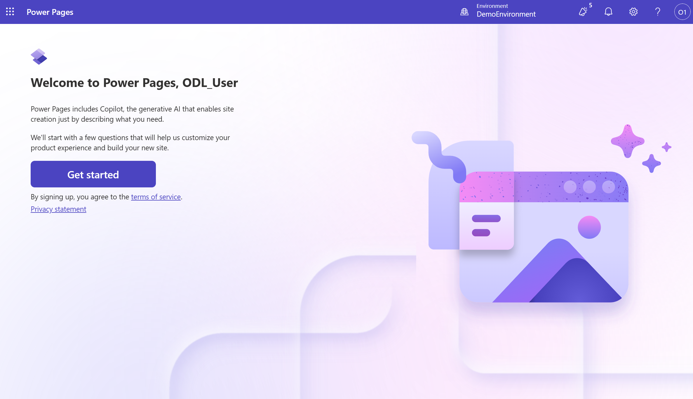

1. Select any industry you want, for example **Finance** and click on **Next**.

    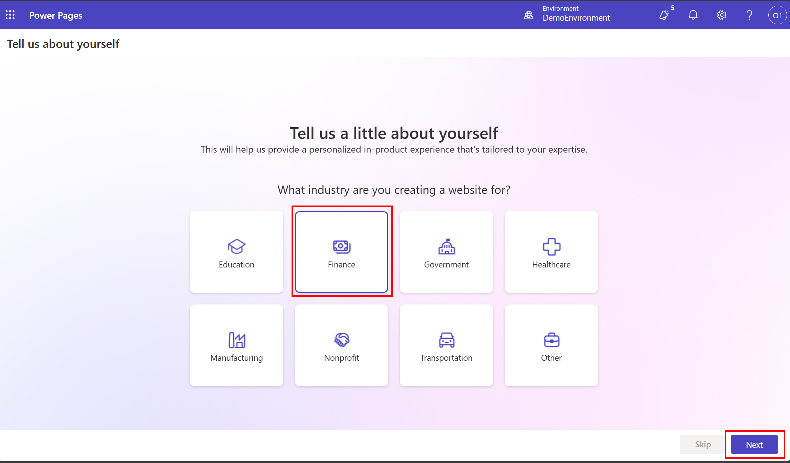

1. Select any of the suggestions or you can also write your own prompt and click on **Build my site**.

    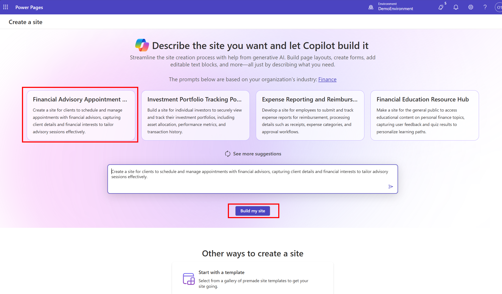

1. Change the site name to **PPCC ALM Dev** and click on **Next**.

    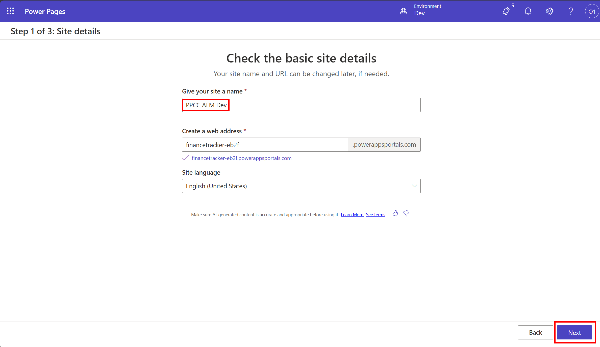

1. If the layout looks good, click on **Next**.

    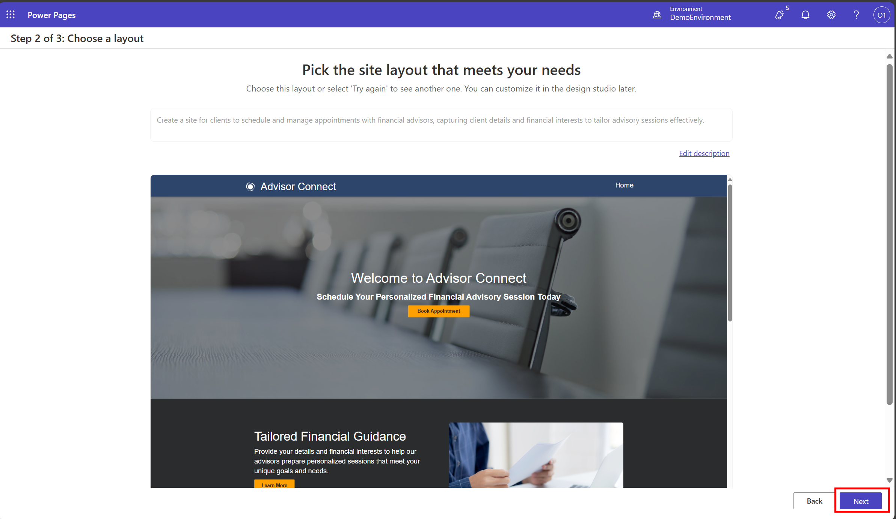

1. Select few pages to be included in the site and click on **Next**.

    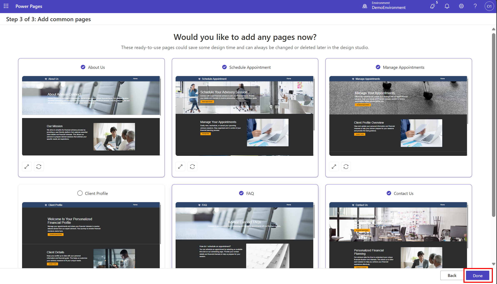

1. Wait for the site to be created.

### 📦 Add site to solution

1. Once the **PPCC ALM Dev** site is ready, navigate to Solutions Explorer and click on **New Solution** to create a new solution.

    

1. Name the solution **PPCCALMDev**, select **CDS Default Publisher** from Publisher dropdown and click **Create**.

    

1. Click on **Objects** from the left menu.

    

1. Click on **Add Existing** button and select **Site** from the dropdown.

    

1. Select the site and click on **Next**.

1. Select **Include All Objects** and click on **Add**.

    

    _Note: You can also include specific objects by clicking **Edit Objects** and selecting them individually._

1. Once the site and its related objects are added to the solution, you will see something like below:

    

### 🚀 Configure Power Pipelines

1. Select the newly created solution and click on **Pipelines** from the left menu.

    

1. Click on **Create Pipeline** button to create a new pipeline.

    

1. Name the pipeline **PPCC ALM Workshop pipeline** and select **Prod** environment as the target environment and click on **Save**.

    

1. Once the pipeline is created, you will see something like below:

    

### 🚀 Deploy to Prod Environment

1. Click on **Deploy Here** button to deploy the solution to **Prod** Environment.

    

1. On the fly out panel, click on **Deploy** button to start the deployment.

1. After the initial verification of deployment is complete, you will get an option to click **“Deploy** on the Summary Panel for Power Pipelines **Deploying Solution** panel.

    

1. The deployment will start. Wait for the deployment to complete.

    

1. Once the deployment is complete, switch to **Prod** environment from top right corner in Power Pages Maker Studio.

    

### 🏗️ Activate Site in Prod Environment

1. Click on **Inactive Sites** tab to view the list of inactive sites.

    

1. Click on **Reactivate** button to activate the site and then click on **Done**.

    

1. _Optional:_ Preview the site by clicking on **Preview** button.

    

### 🛠️ Committing changes to Source Control

1. Go back to **Dev** environment and navigate to **Solutions Explorer** and select the **PPCCALMDev** solution.

1. Select **Source Control** from the left menu.

    

1. Verify that the **Changes** tab has the some changes listed and click on **Commit** button.

    

1. Enter a commit message and click on **Commit** button.

    

1. After the commit is successful, click on the commit id to navigate to Azure DevOps and see the changes reflected in the repository.

    

1. Notice that there are 3 folders created in the repository:
    1. **powerpagesites** - Contains the Power Pages site related files
    1. **solutions** - Contains the solution related files
    1. **publishers** - Contains the publisher information

    

### 💻 Cloning the repository locally

1. Click on **Files** from the left menu in Azure DevOps to go to the repository view.

    

1. Click on **Clone** button and then click on **Clone in VSCode**.

    

    

1. This will open VS Code Desktop and prompt for the local path to clone the repository.

1. It will ask for authentication, provide your Azure DevOps credentials.

1. If asked to automatically sign-in, select **No, this app only**.

   

1. Click on **Open** to open the cloned repository in VS Code.

    

### 💻 Editing the site in VS Code

1. Create a new branch by clicking on Source Control icon from the left menu and then More -> Branch -> Create New Branch. Give the branch name as **feature/add-welcome-message**

    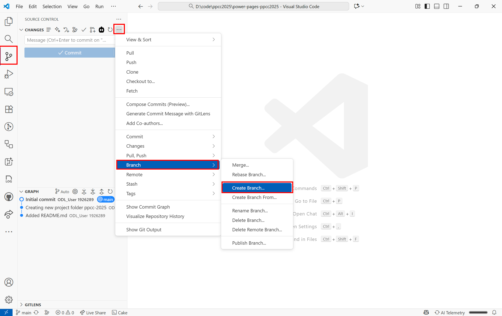

1. Open **Home.webpage.copy.html** file and use GitHub Copilot to add a welcome message to the home page. Click on **Keep** once the Copilot is completed making the changes.

    

1. Once the edits are done, save the file and commit and push the changes.

    

1. Now, go back to Azure DevOps repo and refresh the page. You will see a new branch created named **feature/add-welcome-message**. Click on **Create a pull request** button.

    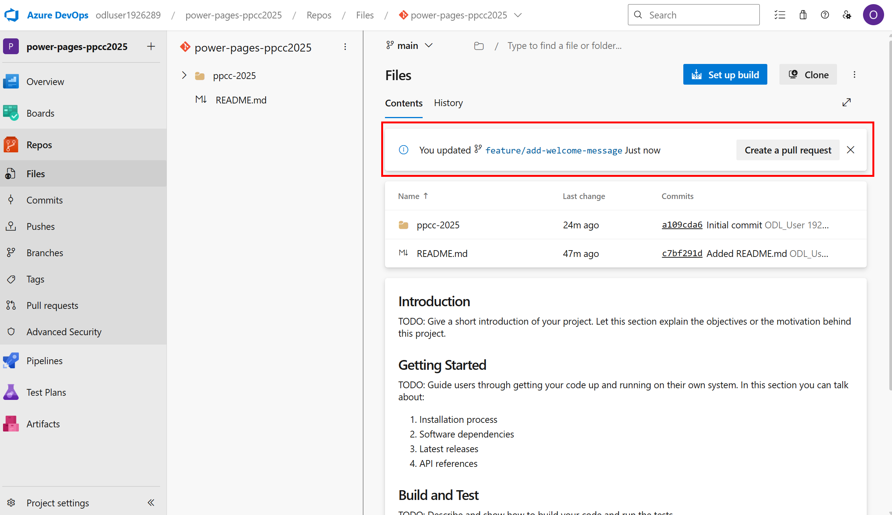

1. You will see the changes made in the pull request. Click on **Create** button to create the pull request.

1. Click on **Files** tab to review the changes and then click on **Complete** button to complete the pull request.

    >**Tip**: In real-world scenarios, you would typically have another team member review the pull request before completing it.

    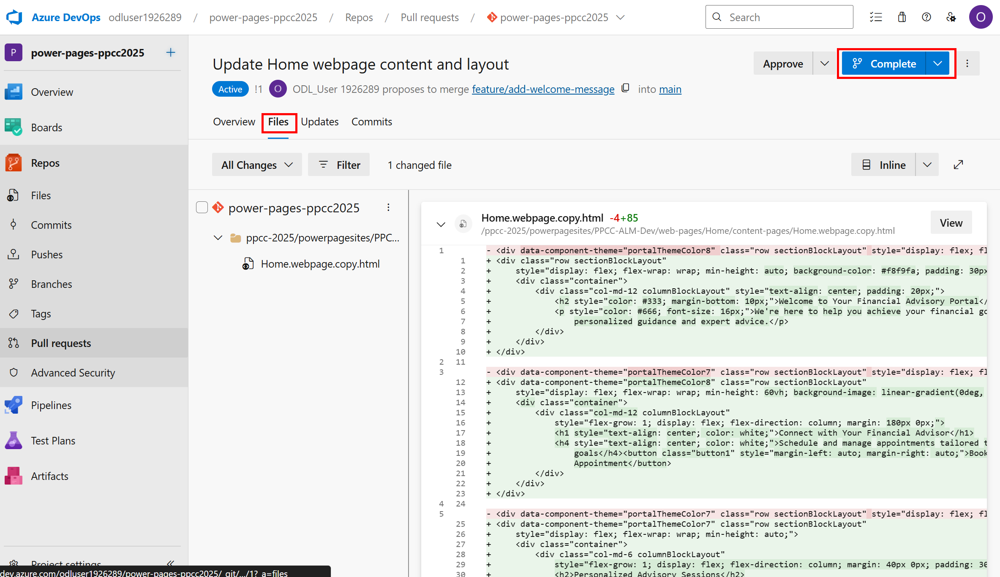

### 🛠️ Pulling changes in Solution Explorer

1. Go back to **Power Pages Maker Studio** in **Dev** environment and navigate to **Solutions Explorer**.

1. Select **Source Control** from the left menu and click on **Check for updates** button. _This might take a while._

    

1. Click on **Pull** button to pull the latest changes in the solution. _This might take a while._

    

### 🛠️ Updating Environment Variables

1. From the **Active Sites** tab, click on **Power Pages Management** for your site.

    

1. Click on Site Settings.

    

1. Search for the setting **Authentication/Registration/LocalLoginEnabled** and click on it to open.

1. Change the value of **Source** to **Environment Variable**.

    

1. Create a new environment variable by selecting the text box and clicking on **New**.

    

1. Click on **Discard Changes** to open the environment variable creation panel.

1. Create new environment variable with **Schema Name** and **Display Name** as **LocalLoginEnabled** and set the default value to **True**. Click on **Save & Close**.

    

1. Now, again change the value of **Source** to **Environment Variable** and search for **Local** and select the newly created environment variable from the dropdown. Click on **Save & Close**.

    

1. Navigate back to **Power Pages Maker Studio** and open **Solutions Explorer** and select the **PPCCALMDev** solution.

1. Add the newly created environment variable to the solution by clicking on **Add Existing** > **Environment Variable**.

    

1. Select **LocalLoginEnabled** from the list and click on **Next** and then click on **Add**.

    

1. The environment variable will be added to the solution.

    

### 🛠️ Deploy the updated solution to Prod Environment

1. Go to **Pipelines** tab and click on **Deploy Here** button to deploy the updated solution to **Prod** environment.

1. Click on **Next** and you'll be asked to select a value for the environment variable. Select **No** and click on **Next**.

    

1. Click on **Deploy** to start the deployment process and wait for the deployment to complete.

### 🔍 Verify changes

1. Open the website preview in **Dev** environment by clicking on **Preview** -> **Desktop**.

    

1. Click on **Sign In** button to verify that the local login is enabled.

    

1. Now, go back to **Power Pages Maker Studio** and switch to **Prod** environment from top right corner and preview the site.

1. Click on **Sign In** button to verify that the local login is disabled.

    

### ❗ _Optional: Manage and deploy Single Page Application using Power Pages_

#### Enable JS extensions for your environments

1. Go to [Power Platform Admin Center](https://admin.powerplatform.microsoft.com/) and select your **Dev** environment.

1. Click on **Settings** and search for **Blocked Attachments**.

    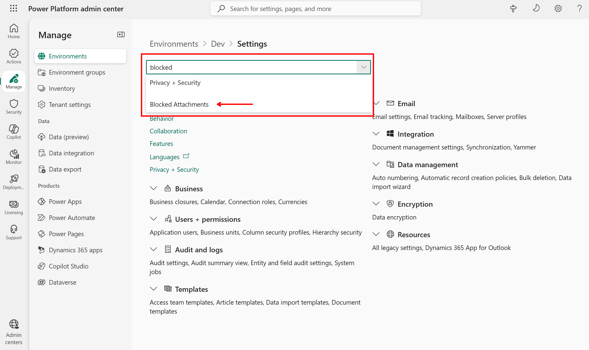

1. Remove **.js** from the list of blocked attachments and click on **Save**.

    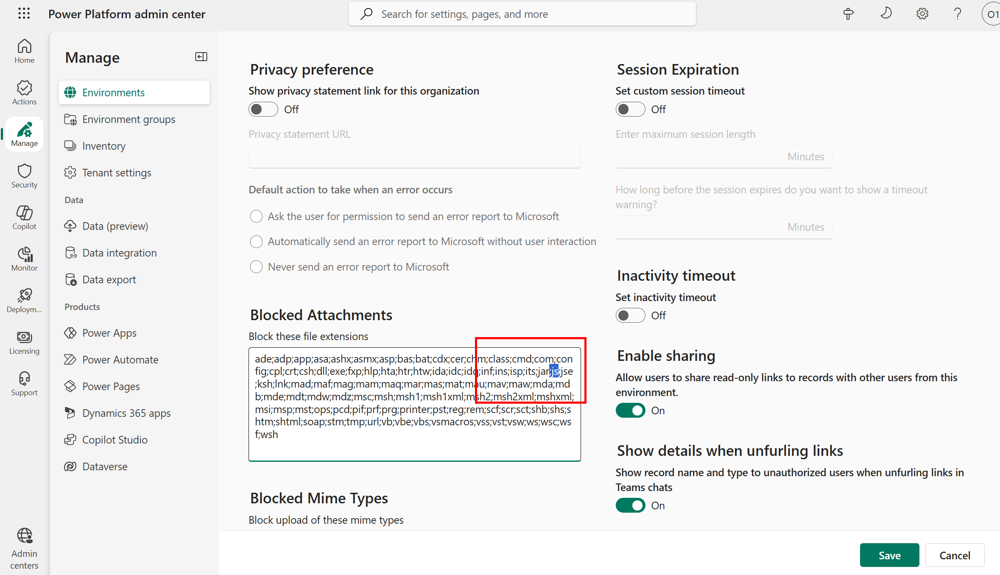

1. Repeat the same steps for **Prod** environment.

#### Deploy Single Page Application site to Power Pages

1. Open a terminal and run `git clone https://github.com/microsoft/power-pages-samples.git` command to clone the [Power Pages samples repo](https://aka.ms/powerpages-samples) locally.

1. Navigate to `samples/bring-your-own-code/react/car-sales-website` folder and open it in VS Code.

1. Complete the steps provided in the [README.md](https://github.com/microsoft/power-pages-samples/tree/main/samples/bring-your-own-code/react/car-sales-website#readme) file to set up the local project and upload the website to **Dev** environment.

1. Switch to **Prod** environment and import the solution imported in **Dev** environment earlier to ensure the dependencies are met.

1. Follow the same steps as above to add the site to a solution and deploy it to **Prod** environment using Power Pipelines.

## Optional: Supercharge your Power Pages development with Power Platform Tools VS Code Extension and PAC MCP Server

Power Platform Tools is a Visual Studio Code extension that streamlines the development and management of Power Pages sites. It offers features such as:

- Copilot for Power Pages
- Liquid intellisense support
- Seamless creation of new content like web pages, web templates etc. using right-click context menus.
- Power Pages Actions: A single place to manage all your Power Pages sites including site upload/download and site preview.

### Install Power Platform Tools Extension

1. Open VS Code Desktop.
1. Click on the Extensions icon from the left menu.
1. Search for **Power Platform Tools** and click on **Install**.

    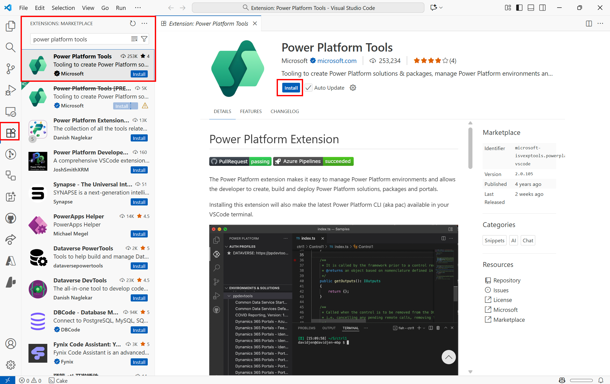

1. After installation, the extension will ask you to login. Use the same credentials you are using for Power Pages Maker Studio.

1. You can also install it from this [VS Code Marketplace](https://marketplace.visualstudio.com/items?itemName=microsoft-IsvExpTools.powerplatform-vscode).

### Install PAC MCP Server

1. Ensure you have latest .NET installed.
1. Download PAC CLI by running below command in terminal:

    ```powershell
    dotnet tool install --global Microsoft.PowerApps.CLI.Tool
    ```

1. Run below command to get the MCP Server location:

    ```powershell
    pac copilot mcp
    ```

1. This will print out the MCP Server location. Copy the URL and add in your VS Code. It should look something like below:

    ```json
    "pac-mcp": {
        "type": "stdio",
        "command": "<MCP Server Location>",
        "args": []
    }
    ```

1. You can now use GitHub Copilot to manage your Power Pages sites using natural language.

    
