# Lab 4: Scenario 1 - Power Pages Site (Enhanced Data Model)

## Pre-requisites

1. Install VS Code Desktop from this [download link](https://code.visualstudio.com/download).
1. Following steps will work on EDM environments. (This should be enabled by default).

## Overview

In this scenario, we will be doing the following:

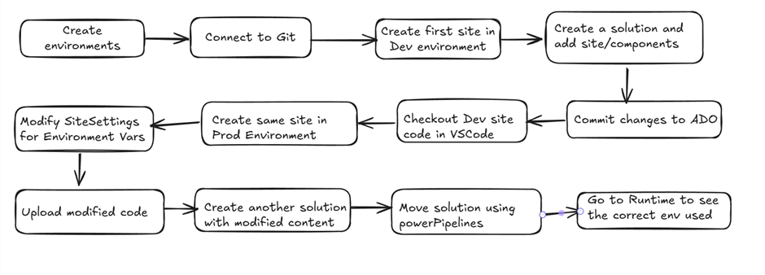

## Steps

1. Setup two managed environments, **DevEnvironment** and **ProdEnvironment**. Follow [these](#steps-to-enable-managed-environment) steps to enable managed environment.

### Configure Azure DevOps

1. Navigate to [Azure DevOps Portal](https://aex.dev.azure.com/) and create a new organization.

    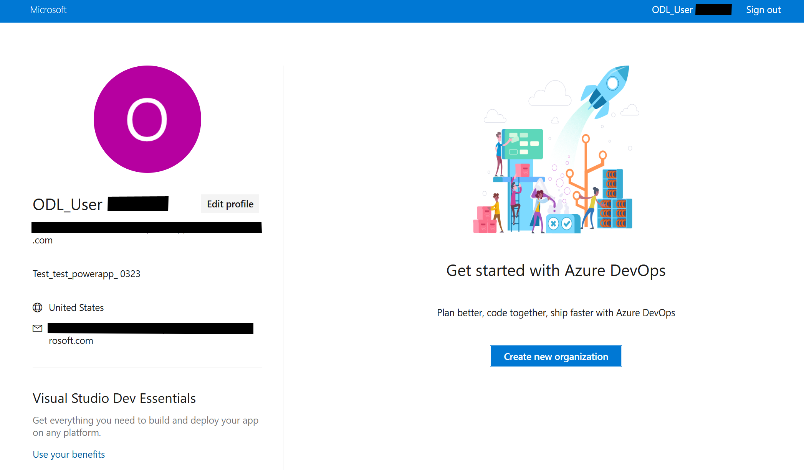

1. Create a new project. This will automatically create a git repository with the same name as the project.

    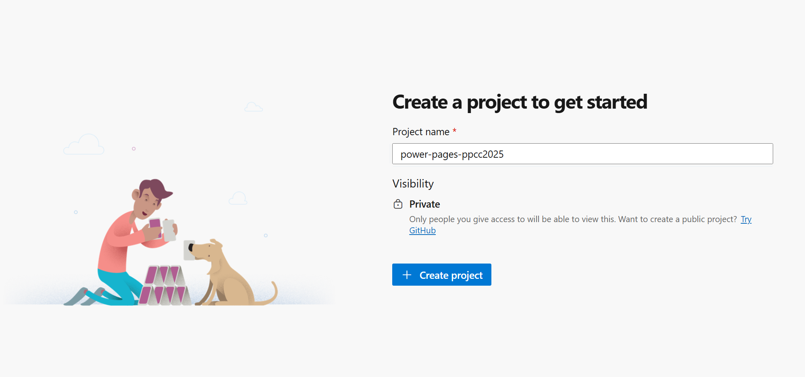

1. In the new project, navigate to **Repos** and initialize it with main branch.

    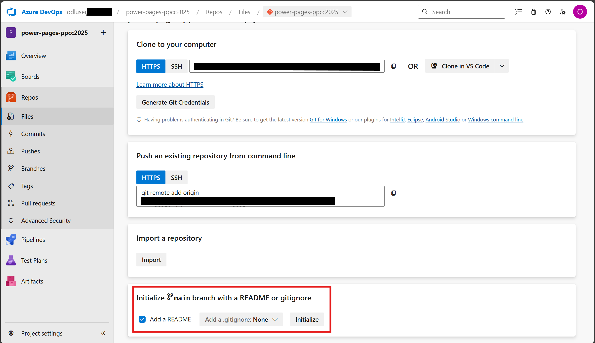

### Create solution and connect to Git

1. In a new tab, open [Power Pages Maker Studio](https://make.powerpages.microsoft.com/) and select **DevEnvironment** from top right corner.

    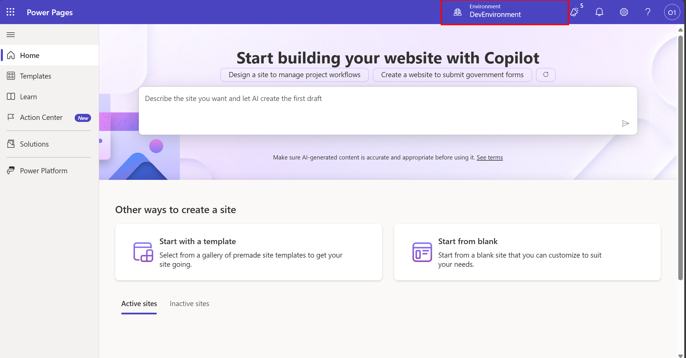

1. Click on **Solutions** option from left burger icon to open Solutions Explorer.

    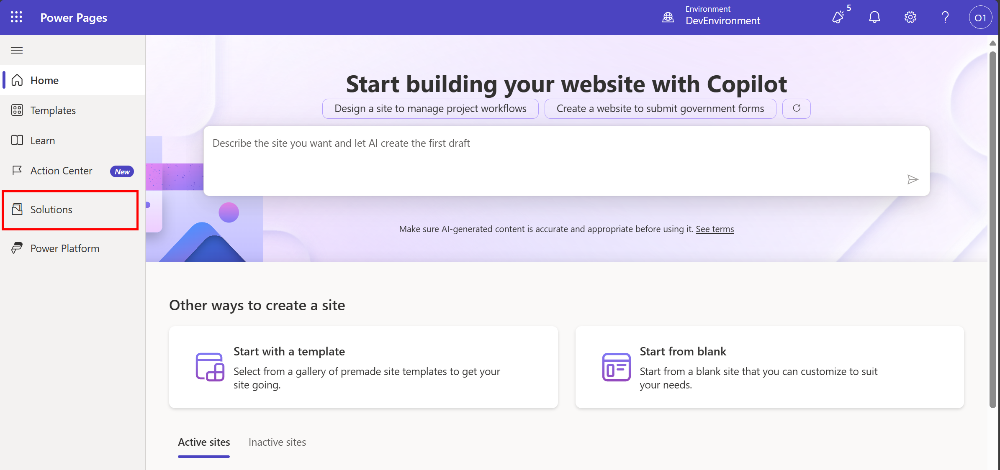

1. Click on **Connect to Git** button to setup your git repository for this environment.

    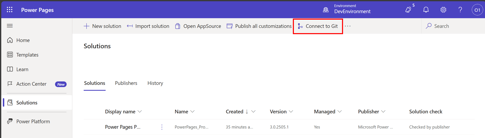

1. Use above created Azure DevOps project to connect to git. You can name the folder as applicable.

    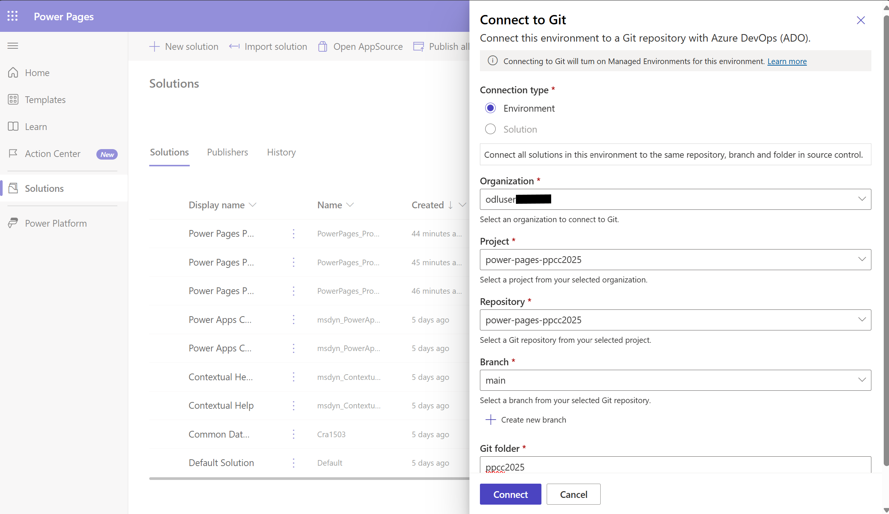

### Create Power Pages site

1. After successful connection, navigate to home and proceed to create your first power pages site **PPCC ALM Dev** using blank template.

    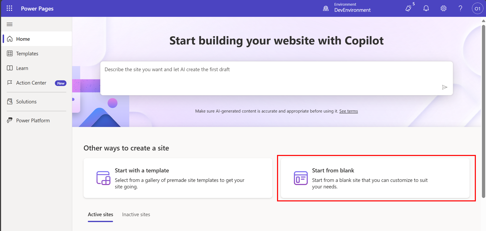

    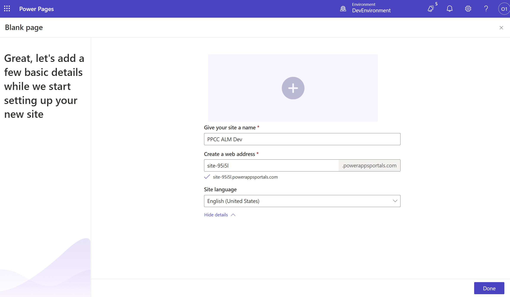

1. Once the **PPCC ALM Dev** site is ready, navigate back to Solutions Explorer and click on **New Solution** to create a new solution.

    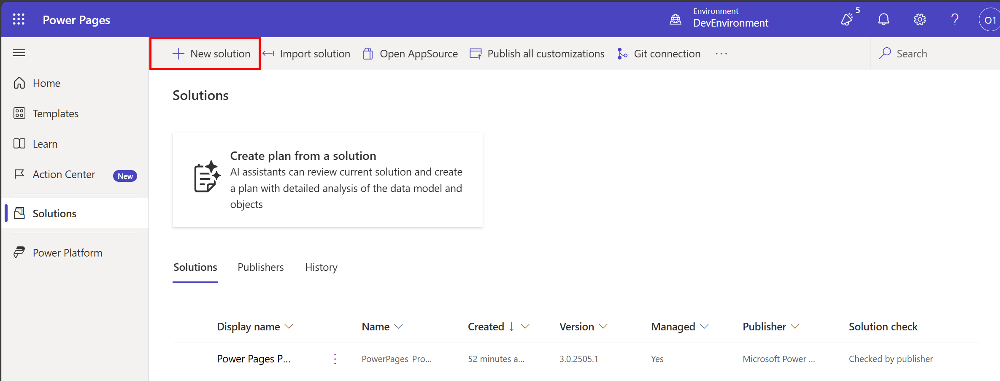

1. Name the solution **PPCCALMDev**, select **CDS Default Publisher** from Publisher dropdown and click **Create**.

    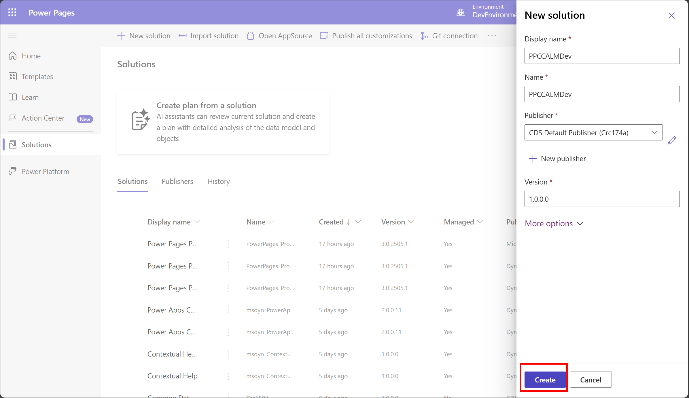

### Configure Power Pipelines

1. Select the newly created solution and click on **Pipelines** from the left menu.

    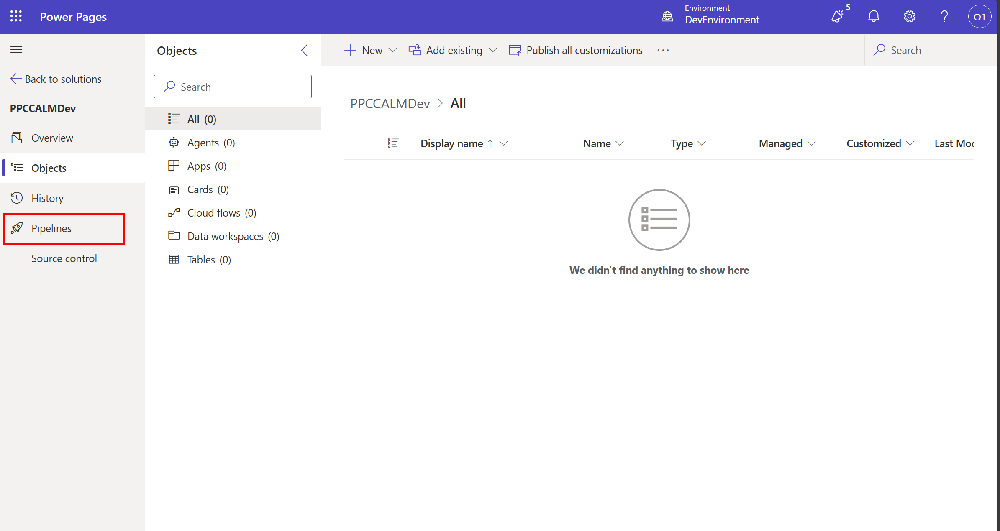

1. Click on **Create Pipeline** button to create a new pipeline.

    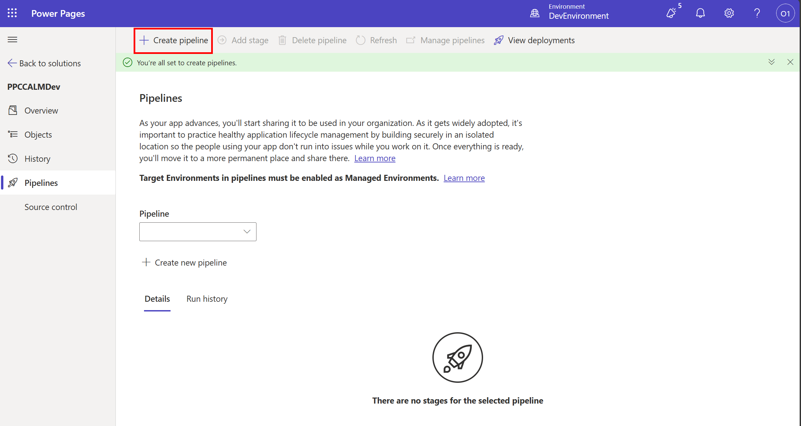

1. Name the pipeline **PPCC ALM Workshop pipeline** and select **ProdEnvironment** as the target environment and click on **Save**.

    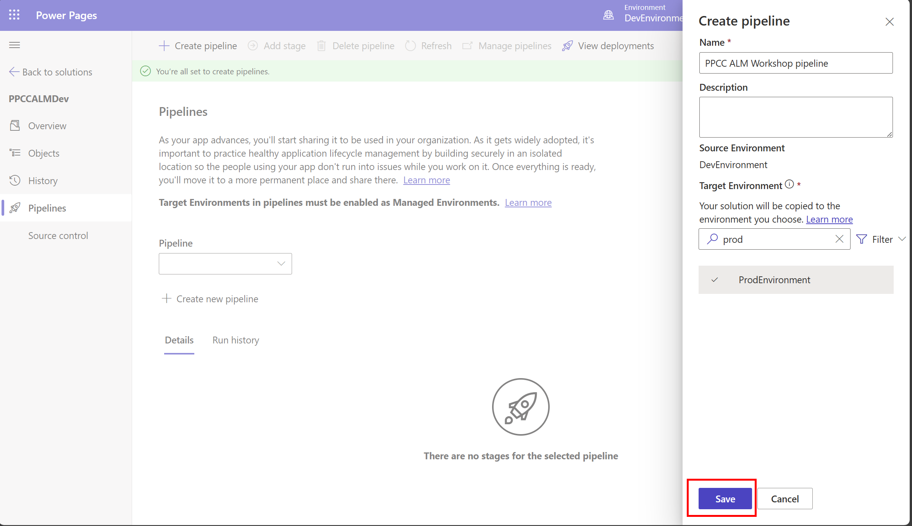

1. Once the pipeline is created, you will see something like below:

    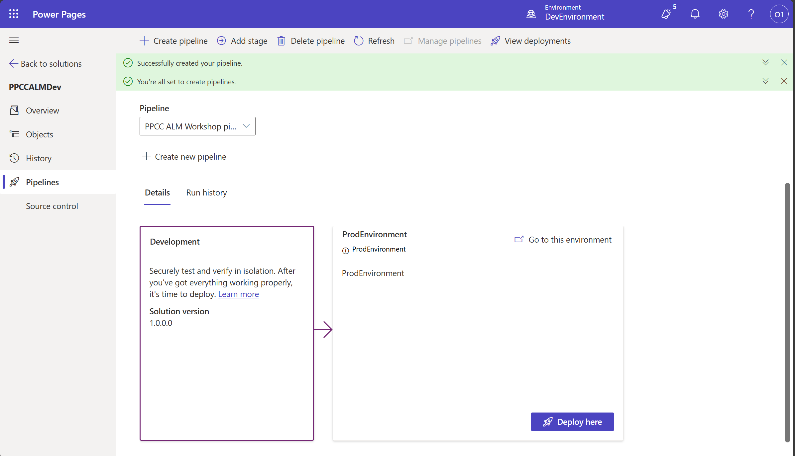

### Deploy to Prod Environment

1. Click on **Deploy Here** button to deploy the solution to ProdEnvironment.

    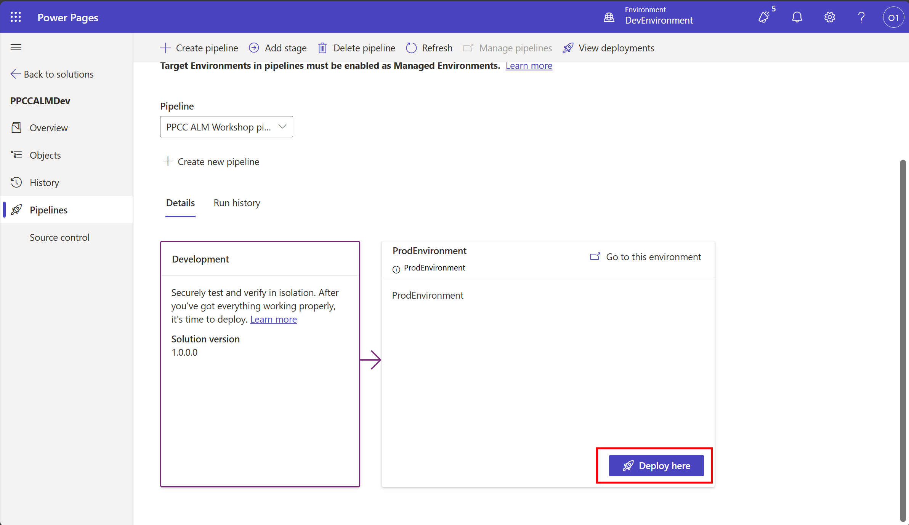

1. On the fly out panel, click on **Deploy** button to start the deployment.

1. After the initial verification of deployment is complete, you will get an option to click **“Deploy** on the Summary Panel for Power Pipelines **Deploying Solution** panel.

    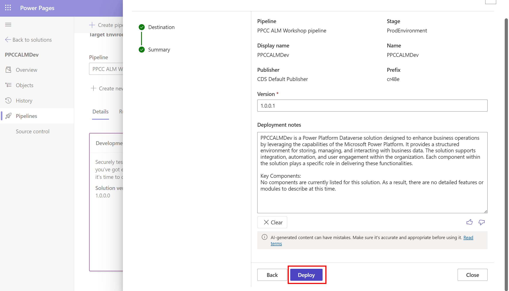

## Steps to enable Managed Environment

1. Navigate to Power Platform Admin Center (PPAC) at <https://admin.powerplatform.microsoft.com/manage/environments>
1. In the Manage tab on the left-hand side, click on **Environments**
1. Select the environment where you want to enable Managed Environments
1. In the ribbon, click **Enable Managed Environments**
1. Click **Enable** in the fly out wizard

    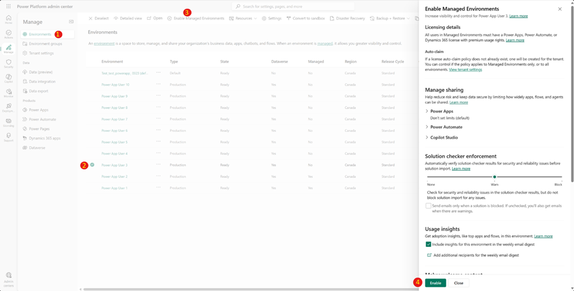
